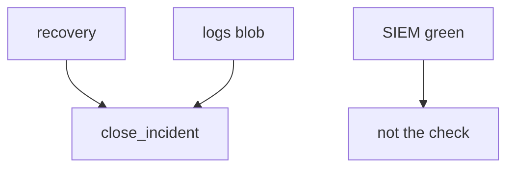
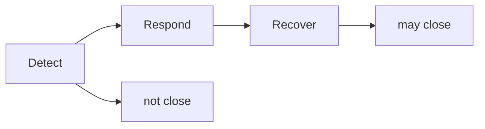

# Close check vs detection quality

**Kind:** design-exercise
**Loop step:** 2 Model

## Could someone else name the close check from your playbook?

“Paging acked” is not this lesson. A drawing someone else can test names **recovery evidence, the log inventory, who can close, and whether note bodies can reach the SIEM**.

`close_incident({recovery, logs})` is local. No live SIEM.

> For close, the rule is deny when recovery is still todo, and deny when logs contain `note_body`. Honest recovery plus safe logs may close. Evidence that the deny is false: `close_incident({"recovery": "todo", "logs": "ok"})` returns true.

If the recovery × logs row is blank, the ticket closes because nobody named the check.

## Picture: three fields

## Picture: detect is not recover

Industry detect / respond / recover labels name outcomes. They are not a product, and they are not this close check.

## Step 1: name the pieces

Take the ticket you already have and ask what would show recovery still has not run.

| Piece | This system |
|---|---|
| Who | Optimistic closer; still-in attacker |
| What | Incident ticket; log pipeline |
| Actions | `close_incident` |
| Paths | SIEM; crash; support tool |
| What you trust for this journey | recovery done and no `note_body` |
| What you do not trust | SIEM green; paging ack; known-exploited list; time-to-detect |
| Time | Restore drill; clocks that actually match |
| The rule | Resilience after prevention failed |

## Step 2: write allow and deny

| Who | What | Action | Decision |
|---|---|---|---|
| closer | recovery todo | close | deny |
| closer | `note_body` in logs | close | deny |
| closer | recovery done + safe logs | close | may allow |
| SIEM green | ticket | treat as recover | deny |

A missing recovery field is how a green tile becomes “Done.” Write the hole.

## Practice

In `labs/10.5/10.5-lab`, mark `ir.py`.

## Use it somewhere new

Clinic SIEM-green close is the same grain with a dashboard instead of a dict.

## What can still go wrong

Imperfect forensics. Support-tool god-mode from earlier cluster lessons. Logging every authorization decision without the sensitive data is extra, advanced work.

## What this page is not doing

Answer keys are not on this site.
