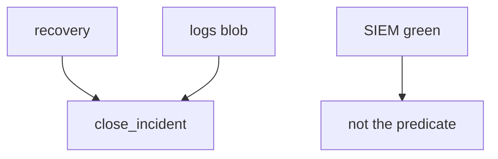
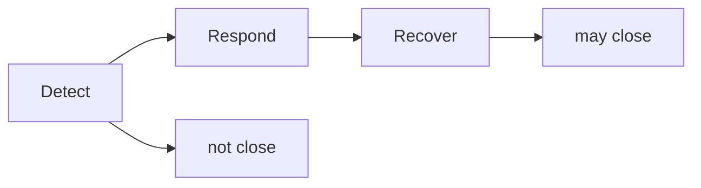

# 10.5-LO-02 — Close predicate vs detection quality

**Kind:** design-exercise
**Loop step:** 2 Model
**Standards:** ASVS `v5.0.0-16.1.1`, `v5.0.0-16.2.5`, `v5.0.0-16.4.3`. NIST CSF 2.0.

## Can a second engineer name the close check from your playbook?

“PagerDuty acked” is not this lesson. A reviewable model names **recovery evidence, log inventory, who can close, and whether note bodies can reach the SIEM**.

SecureCollab freeze: local `close_incident({recovery, logs})`. No live SIEM.

## Mental model: three fields

## Mental model: CSF outcomes are not a product

## Step 1: freeze pieces

| Piece | This system |
|---|---|
| Subjects | optimistic closer; still-in attacker |
| Objects | incident ticket; log pipeline |
| Actions | `close_incident` |
| Channels | SIEM; crash; support tool |
| TCB | recovery=done and no note_body |
| Untrusted | SIEM green; PagerDuty; KEV; MTTD |
| State / time | restore drill; clock sync (`v5.0.0-16.2.2`) |
| 1.1 cell | resilience after prevention failed |

## Step 2: write cells

| Subject | Object | Action | Decision |
|---|---|---|---|
| recovery todo | close | allow | deny |
| note_body in logs | close | allow | deny |
| recovery done + safe logs | close | allow | may allow |
| SIEM green | close | treat as recover | deny |

## Practice

Draw the map. Point at `labs/10.5/10.5-lab` file `ir.py`.

## Transfer

Clinic SIEM-green close is the same grain with a dashboard instead of a dict.

## Residual risk

Imperfect forensics; support-tool god-mode (3.3 / 10.3); L3 clause of `v5.0.0-16.3.2`.

## Non-goals

Top 10 as the definition of security. Keys stay out of lessons.
