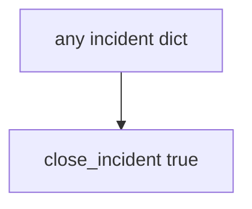

# Practice: always-true close_incident

**Kind:** mechanism-lab
**Loop step:** 3 Break

## Try it

The practice is not a website you attack. It is a tiny Python `close_incident` that returns true for every dict. The failure is already in the function: it never looks at recovery or logs. Watch the check treat that always-true close as a **failed rule**, not as a paperwork nit.

The rule under test:

> An incident must not close without recovery done, and logs must not hold a note body. If `close_incident({"recovery": "todo", "logs": "ok"})` returns true, the close gate has failed as a security control. If `close_incident({"recovery": "done", "logs": "note_body leaked"})` returns true, the log sink has failed the same way.

## Where you may practice

Only `labs/10.5/10.5-lab` is in scope. The practice is an in-process `close_incident(inc)`. The incident is a synthetic dict. Do **not** close, page, or query a real SIEM, paging product, or clinic incident system as the exercise.

Do not paste this exercise onto a public clinic, employer dashboard, or live hospital portal “to see what happens.”

What is supposed to stop this: `close_incident` is supposed to require **recovery done and logs that are not a note store**. A paging ack, time-to-detect, untested backups, and framework access logs are not enough.

Who can close without recovery in this story: an optimistic closer while the actor is still in. That stands in for “alerts stopped so we closed INC-12,” a green SIEM treated as recover, or a known-exploited listing treated as close.

## Picture: close always says yes



The broken files take that path on purpose. You do not need a SIEM. You must not query a live tenant. The true return for recovery todo *is* the leak.

Earlier lessons already said bodies stay out of logs. This check is **detect without recover is theater**.

## What to look at — cause, not a dump

Read `vulnerable/ir.py`. It returns true for every dict. Tests:

- `test_cannot_close_without_recovery`
- `test_cannot_close_when_logs_contain_note_body`
- `test_close_with_recovery_and_safe_logs_may_succeed` — done + ok may pass on both

You do not need a new incident key. The failure of `test_cannot_close_without_recovery` *is* the evidence.

Do not open the repaired files yet. Diagnose the cause first.

| What you see | What kind of failure | Not the lesson |
|---|---|---|
| `return True` for every dict | Close on detection quality; recovery ignored | “The SIEM is green” |
| recovery todo still closes | What must not happen is allowed | A paging ack |
| `note_body` in logs still closes | Logs as a second note store | Time-to-detect |

## Why it happens vs what it costs

| Slice | Practice |
|---|---|
| The rule | recovery todo → close false; `note_body` in logs → close false |
| Why it happens | Close on detection quality; logs as a second note store |
| What has to be true first | `close_incident` true for every dict |
| Trigger | Optimistic closer; still-in attacker |
| What it costs | System still broken; extra note copies |
| How you stop it later | Require recovery done and no `note_body` |
| How you notice later | `incident_closed_without_recovery`; never bodies |
| How you recover later | This *is* the step — restore drill |
| Out of scope | A SIEM product; live paging; claiming an assurance gate |

A SIEM dashboard turns green when alerts stop. A paging ack is a human click. The notes app’s API will log whatever you print. The app’s promise this week is: **this** practice, recovery todo is deny and `note_body` in logs is deny.

## Practice

From the repository root, in a throwaway environment:

```text
python3 -m pytest labs/10.5/10.5-lab/tests --impl vulnerable
```

Run from `labs/10.5/10.5-lab` if a collection at the repo root picks up `site/`. Record `test_cannot_close_without_recovery`. Do not probe public hosts. A setup error is not proof the rule holds.

## Use it somewhere new

Clinic SIEM-green close: predict without leaving this directory. Do not query a live SIEM.

## What this page is not doing

No live-SIEM, paging-product, or public incident-system instructions. This page does not mark you as finished. A known-exploited list is patch input, not close.
