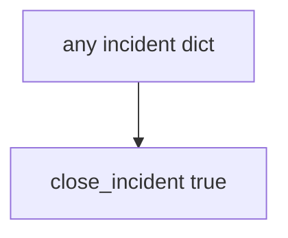

# 10.5-LO-03 — Observe always-true close_incident, do not run live IR

**Kind:** mechanism-lab
**Loop step:** 3 Break
**Standards:** OWASP ASVS 5.0.0 (final) `v5.0.0-16.2.5`. The L3 clause of `v5.0.0-16.3.2` is **Level 3, advanced**. NIST CSF 2.0 Recover as outcome label. CISA KEV as **awareness**. Lab policy: local only.

## Authorized scope

`labs/10.5/10.5-lab` only. The fixture is an in-process `close_incident(inc)`. Synthetic incident dicts. Do **not** close, page, or query a real SIEM, PagerDuty, or clinic IR system as the exercise.

**Forbidden outcomes:** Incident closed without recovery evidence; note body in logs. `close_incident({"recovery": "todo", "logs": "ok"})` returns true. `close_incident({"recovery": "done", "logs": "note_body leaked"})` returns true.

Attacker capability in this lab: an optimistic closer while the actor is still in. That stands in for “alerts stopped so we closed INC-12,” a green SIEM treated as Recover, or a KEV listing treated as close. Trust assumption: `close_incident` is supposed to require **recovery done and logs that are not a note store**. PagerDuty, MTTD, untested backups, and FastAPI access logs are not in the TCB for this cell.

## Mental model: close always says yes



The vulnerable tree demonstrates **cause** (close on detection quality). Do not probe public IR APIs. Preconditions: `close_incident` returns true for every dict. You do not need a SIEM. You must not query a live tenant.

ASVS `v5.0.0-16.2.5` wants logging by protection level — note bodies are not “forensics.” Module 3.1 / 8.5 already said bodies stay out of logs; this cell is **detect without recover is theater**. Gate 10 and M4 stay **not-attempted**.

## What to read in the fixture

`vulnerable/ir.py` returns true for every dict. Tests:

- `test_cannot_close_without_recovery`
- `test_cannot_close_when_logs_contain_note_body`
- `test_close_with_recovery_and_safe_logs_may_succeed` — done + ok may pass on both

You do not need a new incident key. The failure of `test_cannot_close_without_recovery` *is* the evidence.

Do not open the fixed tree yet. Diagnose the cause first.

## Root cause vs impact vs prevention vs detection vs recovery

| Slice | This lab |
|---|---|
| Required property | recovery todo → close false; note_body in logs → close false |
| Root cause | Close on detection quality; logs as a second note store |
| Preconditions | `close_incident` true for every dict |
| Trigger | Optimistic closer; still-in attacker |
| Impact | System still broken; extra note copies |
| Prevention | Require recovery=done and no note_body |
| Detection | `incident_closed_without_recovery`; never bodies |
| Recovery | This *is* the step — restore drill |
| Not the lesson | A SIEM product; live PagerDuty; Gate 10 complete |

## Framework defaults versus the close guarantee

A SIEM dashboard turns green when alerts stop. PagerDuty ack is a human click. FastAPI will log whatever you print. The application guarantee is: **this** fixture, recovery todo is deny and note_body in logs is deny.

## Practice

```text
python3 -m pytest labs/10.5/10.5-lab/tests --impl vulnerable
```

Run from `labs/10.5/10.5-lab` if a repo-root collection picks up `site/`. Record `test_cannot_close_without_recovery`. Do not probe public hosts. An environment error is not security evidence.

## Transfer

Clinic SIEM-green close: predict without leaving this directory. Do not query a live SIEM.

## Non-goals

No live-SIEM, PagerDuty, or public incident-system instructions. Do not claim Gate 10. KEV is patch input, not close.
