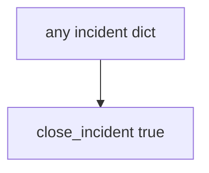

# 10.5-LO-03 — Observe always-true close_incident, do not run live IR

**Kind:** mechanism-lab
**Loop step:** 3 Break
**Standards:** ASVS `v5.0.0-16.2.5`. Lab policy: local only.

## Authorized scope

`labs/10.5/10.5-lab` only. Synthetic incident dicts. Do **not** close, page, or query a real SIEM, PagerDuty, or clinic IR system as the exercise.

**Forbidden outcomes:** Incident closed without recovery evidence; note body in logs.

## Mental model: close always says yes



The vulnerable tree demonstrates **cause** (close on detection quality). Do not probe public IR APIs.

## What to read in the fixture

`vulnerable/ir.py` returns true for every dict. Tests require `close_incident({"recovery": "todo", "logs": "ok"})` to be false, and `note_body` in logs to be false.

## Root cause vs impact

| Slice | Lab |
|---|---|
| Root cause | Close on detection quality |
| Impact | Attacker still in; extra note copies |
| Not the lesson | A SIEM product as the definition |

## Practice

```
python3 -m pytest labs/10.5/10.5-lab/tests --impl vulnerable
```

Record `test_cannot_close_without_recovery`. Do not probe public hosts.

## Transfer

Clinic SIEM-green close: predict without leaving this directory.

## Non-goals

No live-SIEM, PagerDuty, or public incident-system instructions.
