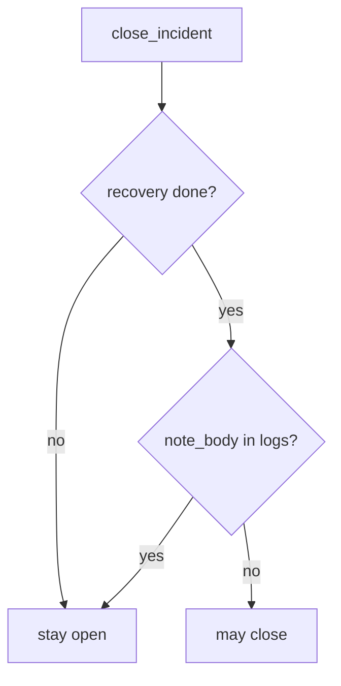

# 10.5-LO-04 — Require recovery done and no note_body

**Kind:** design-exercise
**Loop step:** 4 Build
**Standards:** ASVS 5.0.0 (final) `v5.0.0-16.2.5`, `v5.0.0-16.4.3`. NIST CSF 2.0 Recover as the outcome.

## Structural means close compares recovery and logs

`close_incident` must return true only when `recovery == "done"` **and** `'note_body' not in logs`. Fail-safe: missing recovery or a body in logs denies. SIEM green may *accompany* a match; it does not replace it.

The `note_body` substring is a **teaching stand-in** for protection-level logging (`v5.0.0-16.2.5`). It is not a complete DLP oracle.

## Mental model: conjunction gate



Do not accept “alerts stopped firing” as the conjunction.

## Why this restores the cell

| After the fix | Must be true |
|---|---|
| recovery todo | close false |
| note_body in logs | close false |
| done + ok | close true |

## What this is not

PagerDuty. MTTD. KEV. Gate 10 / M4. Untested backups (residual).

## Practice

Name who can mark recovery done. Run:

```
python3 -m pytest labs/10.5/10.5-lab/tests --impl fixed
```

Must pass.

## Transfer

Clinic: restore test evidence, not a green dashboard.

## Residual risk

Imperfect forensics; observability exfil; support-tool god-mode; L3 clause of `v5.0.0-16.3.2`.
