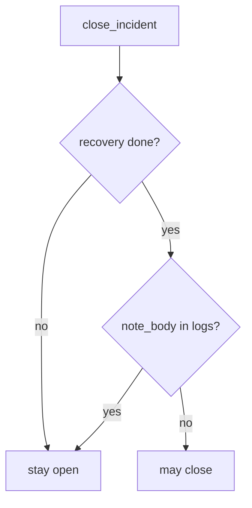

# Require recovery done and no note body

**Kind:** design-exercise
**Loop step:** 4 Build

## The rule

A green SIEM tile is not the fix. A paging ack is not the fix. “Alerts stopped firing so we closed it” is not the fix.

The structural change is: `close_incident` **returns true only when `recovery == "done"` and `'note_body' not in logs`**. Missing recovery or a body in logs is deny. A green SIEM may *accompany* a match; it does not replace it.

The `note_body` substring is a **teaching stand-in** for “logs match how sensitive the data is.” It is not a complete leak scanner. The smallest restore for the notes app’s incident ticket is: recovery todo → stay open, and a leaked body → stay open. Fail-safe: a missing field is deny. Do not fail open because the dashboard went green. Do not accept “alerts stopped” as the conjunction.

## Picture: recovery-done and no-body together



The repaired files require that conjunction. Production still needs restore to have *run* — `"done"` typed by an optimistic closer is a lying recovery. Untested backups remain leftover. Logs still belong on a separate system so an app breach does not erase evidence. Logging every authorization decision without the sensitive data is extra, advanced work.

Industry “recover” is an outcome — close-without-recovery.

## What the repaired files must show

Do not treat `fixed/ir.py` as a production incident product.

| After the fix | Must be true |
|---|---|
| recovery todo | close false |
| `note_body` in logs | close false |
| done + ok | close true |

Fail closed: if you are unsure whether restore ran, keep the ticket open. Uncertainty is a **no** on close, not a yes because the SIEM is green.

## What this is not

- A paging product.
- Time-to-detect.
- A known-exploited listing.
- An assurance-gate sticker.
- Untested backups.
- A SIEM vendor.
- A logging cheat sheet as the check.

## What the tool cannot do

- `"done"` without a restore drill is a lying field.
- Substring `note_body` is a stand-in, not a leak scanner.
- Clocks that match across hosts are not this check.
- Support-tool god-mode is a different leftover from earlier cluster lessons.
- Crash and observability sinks remain sibling copies of the note.

## Practice

Name who can mark recovery done. Run:

```text
python3 -m pytest labs/10.5/10.5-lab/tests --impl fixed
```

## Use it somewhere new

A clinic example: restore-test evidence, not a green dashboard. The lab still uses fake strings.

## What can still go wrong

Imperfect forensics. Observability as a way out. Support-tool god-mode. Logging every authorization decision without the sensitive data.

## What this page is not doing

Do not query a live SIEM. This page does not mark you as finished. A green tile is not a check-in. Do not present a known-exploited list as close.
