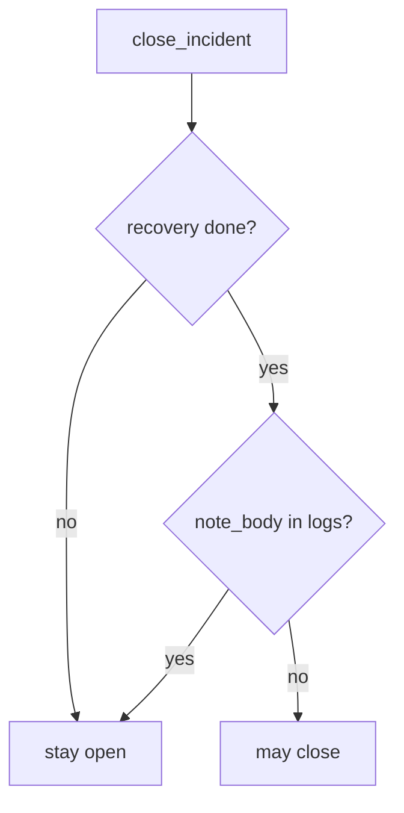

# 10.5-LO-04 — Require recovery done and no note_body

**Kind:** design-exercise
**Loop step:** 4 Build
**Standards:** ASVS 5.0.0 (final) `v5.0.0-16.2.5`, `v5.0.0-16.4.3`. NIST CSF 2.0 Recover as the outcome. The L3 clause of `v5.0.0-16.3.2` is **Level 3, advanced**.

## Structural means close compares recovery and logs

`close_incident` must return true only when `recovery == "done"` **and** `'note_body' not in logs`. Fail-safe: missing recovery or a body in logs denies. SIEM green may *accompany* a match; it does not replace it.

The `note_body` substring is a **teaching stand-in** for protection-level logging (`v5.0.0-16.2.5`). It is not a complete DLP oracle. The smallest restore for SecureCollab’s incident ticket is: recovery todo → stay open, and a leaked body → stay open.

## Mental model: recovery-done and no-body conjunction



Do not accept “alerts stopped firing” as the conjunction. Production still needs restore to have *run* — `"done"` typed by an optimistic closer is a lying recovery. Untested backups remain residual. `v5.0.0-16.4.3` wants logs on a logically separate system so an app breach does not erase evidence. The L3 clause of `v5.0.0-16.3.2` (log all authorization decisions without the sensitive data) is Level 3 advanced.

CSF 2.0 Recover is an outcome. This pytest is that sentence for close-without-recovery.

## Why this restores the cell

| After the fix | Must be true |
|---|---|
| recovery todo | close false |
| note_body in logs | close false |
| done + ok | close true |

## What this is not

PagerDuty. MTTD. KEV. Gate 10 / M4. Untested backups (residual). A SIEM vendor. Logging Cheat Sheet as the oracle.

## Mechanism limits

- `"done"` without a restore drill is a lying field.
- Substring `note_body` is a stand-in, not DLP.
- Clocks (`v5.0.0-16.2.2`) are not this predicate.
- Support-tool god-mode is 3.3.
- Observability exfil (8.5 web Sentry) remains a sibling sink.

## Practice

Name who can mark recovery done. Run:

```text
python3 -m pytest labs/10.5/10.5-lab/tests --impl fixed
```

Must pass. Run from the lab directory if collection at repo root is polluted.

## Transfer

Clinic: restore test evidence, not a green dashboard.

## Residual risk

Imperfect forensics; observability exfil; support-tool god-mode; L3 clause of `v5.0.0-16.3.2`.

## Non-goals

Do not query a live SIEM. Do not claim Gate 10 from a green tile. Do not present KEV as close.
