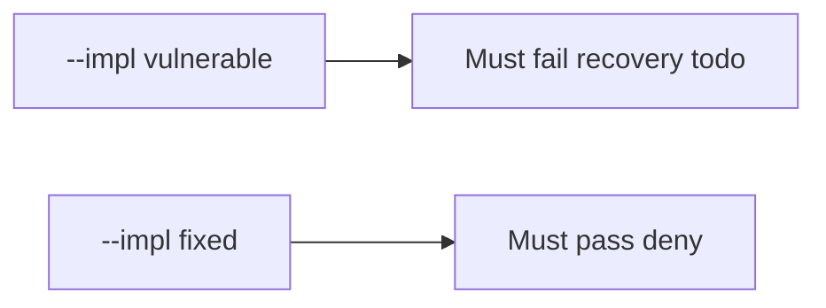

# 10.5-LO-05 — Evidence is close denied, then a passing pair

**Kind:** verification-lab
**Loop step:** 5 Verify
**Standards:** ASVS `v5.0.0-16.2.5`.

## An invariant that cannot fail a test is still a slogan

“SIEM green” is not evidence. The oracle is the local pair. Do not query a live SIEM.

## Mental model: fail-on-vulnerable, pass-on-fixed



| Case | Must show |
|---|---|
| Negative / abuse | recovery todo → not close |
| Negative / abuse | note_body in logs → not close |
| Normal | done + ok → may close |
| Not claimed | live PagerDuty; KEV; Gate 10 |

```
python3 -m pytest labs/10.5/10.5-lab/tests --impl vulnerable
python3 -m pytest labs/10.5/10.5-lab/tests --impl fixed
```

Honest recovery + safe logs may pass on both.

## What the tests do not prove

- Restore actually ran
- Clocks are synced (`v5.0.0-16.2.2`)
- Logs are on a separate system (`v5.0.0-16.4.3`)
- Support tool is least privilege

## Practice

Execute both implementations. Map each test to an LO-02 cell.

## Transfer

Clinic: a test that only asserts “alert fired” is not this cell.
