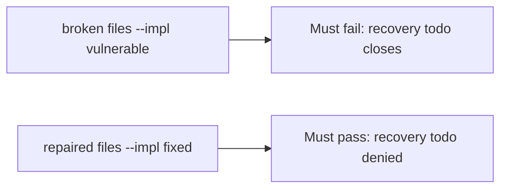

# A broken close gate must fail the check

**Kind:** verification-lab
**Loop step:** 5 Verify

## Check it

A green SIEM tile does not close an incident with recovery still todo. An ack on the pager is an ack. Recovery todo has to stay unclosed, `note_body` must stay out of the logs, and done + ok may close. Broken: recovery-todo still closes. Repair leaves recovery-todo unclosed. Do not query a live SIEM.

## Picture: a broken close gate must fail the check

A close with recovery still marked todo can go through a green suite.



If the broken close still passes, recovery-todo was never the failing close.

The second what must not happen is **`note_body` in logs** — `test_cannot_close_when_logs_contain_note_body` must also fail on the broken files.

## What the check has to show

| Mode | Must show for this topic |
|---|---|
| Wrong input | recovery todo → cannot close; broken files must fail |
| Abuse | `note_body` in logs → cannot close |
| Normal | done + ok → may close (may pass on both) |
| Not claimed | live paging; a known-exploited list; a check-in; that restore actually ran |

`test_cannot_close_without_recovery` keeps `close_incident` from always returning true.

A close with recovery done and safe logs may pass on both sides. You still have to deny a close that skipped recovery, and a close whose logs hold a note. If the broken files do not fail `test_cannot_close_without_recovery`, the lab is miswired — fix the wiring, not the assertion.

```text
python3 -m pytest labs/10.5/10.5-lab/tests --impl vulnerable
python3 -m pytest labs/10.5/10.5-lab/tests --impl fixed
```

A paging-product name in a runbook is not `close_incident({"recovery": "todo", "logs": "ok"})`. This practice never opens a live host.

## What the tests do not prove

- That restore actually ran
- That clocks match across hosts
- That logs live on a separate system
- That the support tool is least privilege
- Logging every authorization decision without the sensitive data
- This page does not close an incident check-in

## Practice

Call `close_incident({"recovery": "todo", "logs": "ok"})`. A paging-product name in a runbook is a vendor, not the close.

## Use it somewhere new

An alert that fired is the page, not recovery-todo closed. Do not use a live SIEM.

## What this page is not doing

A live incident screenshot is not recovery-todo closed. Do not log note bodies. Answer keys are not on this site. This page does not mark you as finished.
