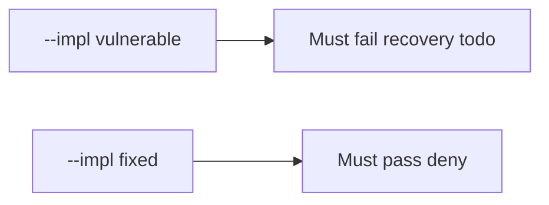

# 10.5-LO-05 — Evidence is close denied, then a passing pair

**Kind:** verification-lab
**Loop step:** 5 Verify
**Standards:** ASVS `v5.0.0-16.2.5`. NIST CSF 2.0 Recover as label, not the oracle.

## An invariant that cannot fail a test is still a slogan

“SIEM green” is not evidence. “PagerDuty acked” is a mechanism observation. The oracle is: recovery todo is false, note_body in logs is false, and done + ok may close. The recovery-todo observation must be **false** on `--impl vulnerable` (returns true) and **true** on `--impl fixed`. Do not query a live SIEM.

## Mental model: vulnerable must fail: recovery todo

The failing observation on `--impl vulnerable` is **recovery todo**. A passing collection count is not this cell. The second forbidden outcome is **note_body in logs** — `test_cannot_close_when_logs_contain_note_body` must also fail on vulnerable.



| Mode | Must show for this module |
|---|---|
| Negative / abuse | recovery todo → not close; vulnerable must fail |
| Negative / abuse | note_body in logs → not close |
| Normal | done + ok → may close (may pass on both) |
| Not claimed | live PagerDuty; KEV; Gate 10; that restore ran |

Lab tests in `labs/10.5/10.5-lab/tests/test_property.py`. `test_cannot_close_without_recovery` is a **forbidden-outcome** test: always-true `close_incident` is not allowed to count as a passing control.

```text
python3 -m pytest labs/10.5/10.5-lab/tests --impl vulnerable
python3 -m pytest labs/10.5/10.5-lab/tests --impl fixed
```

Honest recovery + safe logs may pass on both implementations. That does not excuse the two deny tests. If vulnerable does not fail `test_cannot_close_without_recovery`, the lab is miswired—fix the wiring, not the assertion.

## What the tests do not prove

- Restore actually ran
- Clocks are synced (`v5.0.0-16.2.2`)
- Logs are on a separate system (`v5.0.0-16.4.3`)
- Support tool is least privilege
- L3 clause of `v5.0.0-16.3.2`
- Gate 10 / M4 complete

Record those as residuals or later modules, not as silent passes.

## Practice

Execute both implementations this session from the lab directory if needed. Write the fail/pass pair next to the matrix row. Reject a “test” that only greps `PagerDuty` in a runbook without calling `close_incident({"recovery": "todo", "logs": "ok"})`.

## Transfer

Clinic: a test that only asserts “alert fired” is not this cell. A live SIEM is out of scope.

## Non-goals

Do not add a live-IR trophy. Do not log note bodies. Keys stay out of this file. Gate 10 stays not-attempted.
