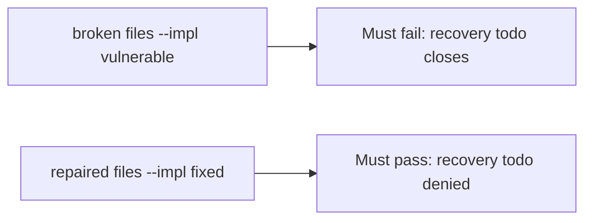

# A broken close gate must fail the check

**Kind:** verification-lab
**Loop step:** 5 Verify

## Check it

“SIEM green” is not evidence. “Paging acked” is a tool observation. The check is: recovery todo is false, `note_body` in logs is false, and done + ok may close. The recovery-todo observation must be **false** on the broken files and **true** on the repaired files. Do not query a live SIEM.

## Picture: a broken close gate must fail the check

A passing-test tally can still hide that recovery todo still closes.



If both pass, you are not looking at recovery todo.

The second what must not happen is **`note_body` in logs** — `test_cannot_close_when_logs_contain_note_body` must also fail on the broken files.

## What the check has to show

| Mode | Must show for this topic |
|---|---|
| Wrong input | recovery todo → cannot close; broken files must fail |
| Abuse | `note_body` in logs → cannot close |
| Normal | done + ok → may close (may pass on both) |
| Not claimed | live paging; a known-exploited list; an assurance gate; that restore actually ran |

The test `test_cannot_close_without_recovery` is there so always-true `close_incident` still fails.

A close with recovery done and safe logs may pass on both sides. You still have to deny a close that skipped recovery, and a close whose logs hold a note. If the broken files do not fail `test_cannot_close_without_recovery`, the lab is miswired — fix the wiring, not the assertion.

```text
python3 -m pytest labs/10.5/10.5-lab/tests --impl vulnerable
python3 -m pytest labs/10.5/10.5-lab/tests --impl fixed
```

Searching for `PagerDuty` in a runbook without calling `close_incident({"recovery": "todo", "logs": "ok"})` is not evidence. This practice never opens a live host.

## What the tests do not prove

- That restore actually ran
- That clocks match across hosts
- That logs live on a separate system
- That the support tool is least privilege
- Logging every authorization decision without the sensitive data
- An assurance gate complete

## Practice

Do not treat a grep for a paging product name as the check. Call `close_incident({"recovery": "todo", "logs": "ok"})`.

## Use it somewhere new

Asserting “alert fired” is not this check. Do not use a live SIEM.

## What this page is not doing

Do not treat a live incident screenshot as proof. Do not log note bodies. Answer keys are not on this site. This page does not mark you as finished.
