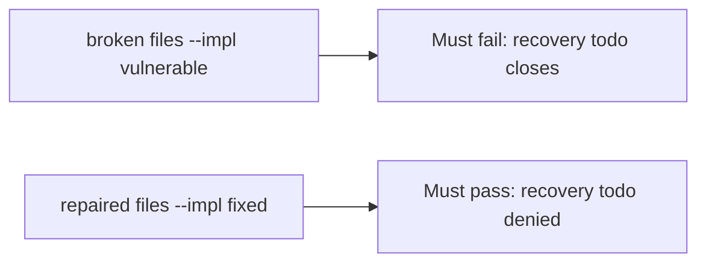

# Fail on the broken files, then pass on the repaired ones

**Kind:** verification-lab
**Loop step:** 5 Verify

## If you cannot test it, it is still a slogan

“SIEM green” is not evidence. “Paging acked” is a tool observation. The check is: recovery todo is false, `note_body` in logs is false, and done + ok may close. The recovery-todo observation must be **false** on the broken files and **true** on the repaired files. Do not query a live SIEM.

## Picture: a broken close gate must fail the check

A test that only counts passing tests can pass while recovery todo still closes. This check asks whether an incident closed without recovery still counts as a passing control. Broken must fail that question. Repaired must pass it.



If both pass, the test is not looking at recovery todo. If both fail, the fix is not structural or the check is wrong.

The second forbidden outcome is **`note_body` in logs** — `test_cannot_close_when_logs_contain_note_body` must also fail on the broken files.

## Four modes, even for a close dict

| Mode | Must show for this topic |
|---|---|
| Wrong input | recovery todo → cannot close; broken files must fail |
| Abuse | `note_body` in logs → cannot close |
| Normal | done + ok → may close (may pass on both) |
| Not claimed | live paging; a known-exploited list; an assurance gate; that restore actually ran |

The file is `labs/10.5/10.5-lab/tests/test_property.py`. The test `test_cannot_close_without_recovery` is a **what-must-not-happen** test: always-true `close_incident` is not allowed to count as a passing control.

Honest recovery plus safe logs may pass on both implementations. That does not excuse the two deny tests. If the broken files do not fail `test_cannot_close_without_recovery`, the lab is miswired — fix the wiring, not the assertion.

```text
python3 -m pytest labs/10.5/10.5-lab/tests --impl vulnerable
python3 -m pytest labs/10.5/10.5-lab/tests --impl fixed
```

A test that only greps `PagerDuty` in a runbook without calling `close_incident({"recovery": "todo", "logs": "ok"})` is not this topic’s evidence. This practice never opens a live host.

## What the tests do not prove

- That restore actually ran
- That clocks match across hosts
- That logs live on a separate system
- That the support tool is least privilege
- Logging every authorization decision without the sensitive data
- An assurance gate complete

Record those as leftover or later topics, not as silent passes.

## Practice

Run both this session from the lab directory if needed:

```text
python3 -m pytest labs/10.5/10.5-lab/tests --impl vulnerable
python3 -m pytest labs/10.5/10.5-lab/tests --impl fixed
```

Paste nothing from answer keys. Write fail/pass into your notes next to the close-without-recovery row. Reject a “test” that only greps a paging product name without calling `close_incident({"recovery": "todo", "logs": "ok"})`.

## Use it somewhere new

Clinic: a test that only asserts “alert fired” is not this topic. A live SIEM is out of scope.

## What this page is not doing

Do not add a live-incident trophy. Do not log note bodies. Answer keys stay out of this file. Do not claim you finished an assurance gate.
