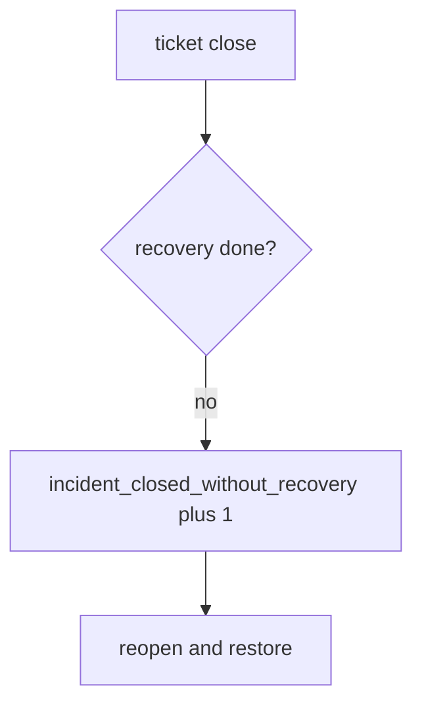

# Notice a close without recovery, without logging notes

**Kind:** operations-exercise
**Loop step:** 6 Operate

## Fixing it once is not enough

A closer can still mark Done after `close_incident` was “fixed once.” Do not log note bodies, session tokens, or dump files into the ticket. Do not paste note text into chat.

## Picture: illegal close is a signal

A close that skipped recovery is something you still have to notice and recover from, not an excuse to quote the note in the paging channel. The notice should name the incident. Recover reopens and runs the restore drill.



A SIEM product is not the rule, and a restore-ran tile is not proof.

Re-run `test_cannot_close_without_recovery` after any close-workflow change. A green “alerts stopped” tile is not that check. Also re-run `test_cannot_close_when_logs_contain_note_body` — a second sink (crash reports, web telemetry) can reopen the leftover-body hole.

## Signals that do not become a second leak

| Outcome | This topic |
|---|---|
| Notice | `incident_closed_without_recovery` |
| What the line holds | Incident id, recovery state; **never** note bodies |
| Respond | Stop the closer that ignored recovery; do not paste note text into chat |
| Recover | Reopen; run restore drill; revoke leftover sessions |
| Leftover | Imperfect forensics; observability as a way out; recovery marked “not applicable” without an exception process |

A SIEM dashboard will show time-to-detect and stay silent when CI’s `close_incident` is always true. Detection must observe **recovery todo is deny**, not alert volume. If the alert includes a note body, you have opened a leftover-body leak.

```text
log_denied reason=incident_closed_without_recovery id=INC-12 recovery=todo
```

Not: a note body, a session token, or “assurance gate complete.”

If your alert includes the matching note, you have copied the leak into the paging channel.

## What the framework does vs what you still have to check

The same always-true close, leftover bodies, and support-tool god-mode that bypass this practice will also bypass a “scan our SIEM dashboard” detector.

Cause vs cost stays split here too: the **cause** is close looking at detection quality instead of recovery done and no `note_body`; the **cost** is an attacker still in plus extra note copies; **how you stop it** is the conjunction; **how you notice** is `incident_closed_without_recovery`; **how you recover** is reopen and restore. What the tool cannot do: this alert does not prove the restore drill ran, and it does not ship logs to a separate system.

## Can people still use it

A reopen notice must say *recovery still todo*, not only “assert False.” Under stress, do not use color-only severity.

## Practice

```text
log_denied reason=incident_closed_without_recovery id=INC-12 recovery=todo
```

Reject any line that includes a note body, a session token, or “assurance gate complete.”

## Use it somewhere new

A clinic example: reopen the SIEM-green ticket; do not paste note text into chat. Do not query a live SIEM.

## What this page is not doing

A SIEM-vendor name is not the rule. This page does not mark you as finished. A known-exploited listing is not close. Answer keys are not on this site.
