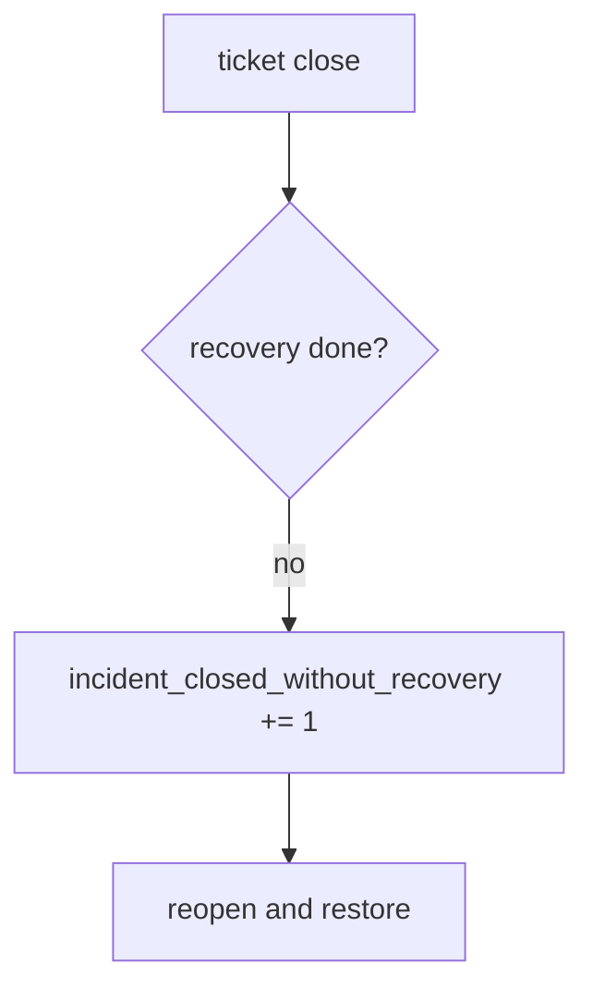

# 10.5-LO-06 — Detect incident_closed_without_recovery without logging bodies

**Kind:** operations-exercise
**Loop step:** 6 Operate
**Standards:** NIST CSF 2.0 (final) DE/RS/RC as outcome labels; ASVS `v5.0.0-16.2.5`, `v5.0.0-16.4.3`.

## Prevention is not absolute

A closer can bypass the ticket UI. Pair detect and recover. Do not log note bodies, session tokens, or dump files into the ticket (3.1).

## Mental model: illegal close is a signal



| Outcome | This module |
|---|---|
| Detect | `incident_closed_without_recovery` |
| Signal | incident id, recovery state; never note bodies |
| Recover | Reopen; run restore drill; revoke leftover sessions (4.3) |
| Residual | Imperfect forensics; E6 N/A |

## Practice

Write one log line you would accept. Tie it to `labs/10.5/10.5-lab`.

```
log_denied reason=incident_closed_without_recovery id=INC-12 recovery=todo
```

Reject any line that includes a note body, a session token, or “Gate 10 complete.”

## Transfer

Clinic: reopen the SIEM-green ticket; do not paste note text into Slack.

## Non-goals

A SIEM-vendor name is not the property. M4 stays not-attempted.
