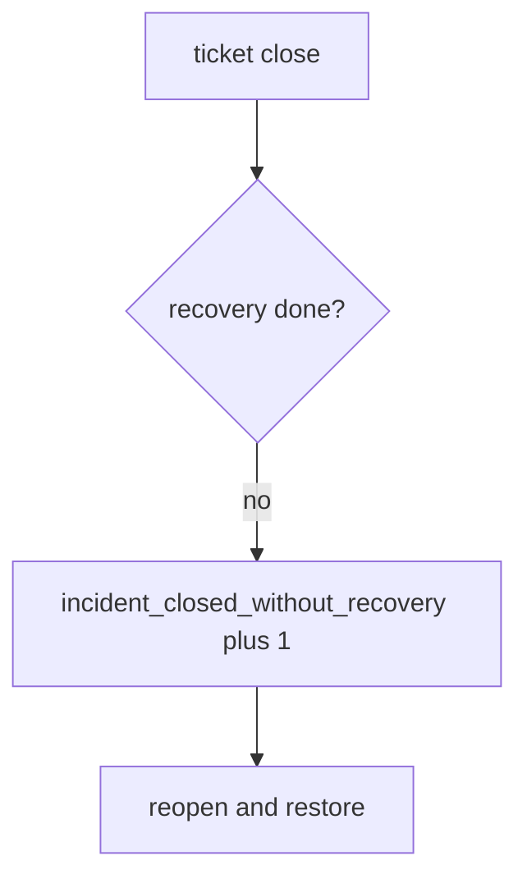

# 10.5-LO-06 — Detect incident_closed_without_recovery without logging bodies

**Kind:** operations-exercise
**Loop step:** 6 Operate
**Standards:** NIST CSF 2.0 (final) DE/RS/RC as outcome labels; ASVS `v5.0.0-16.2.5`, `v5.0.0-16.4.3`.

## Prevention is not absolute

A closer can bypass the ticket UI. Pair detect and recover. Do not log note bodies, session tokens, or dump files into the ticket (3.1). Do not paste note text into Slack.

## Mental model: illegal close is a signal



| Outcome | This module |
|---|---|
| Detect | `incident_closed_without_recovery` |
| Signal | incident id, recovery state; never note bodies |
| Recover | Reopen; run restore drill; revoke leftover sessions (4.3) |
| Residual | Imperfect forensics; observability exfil; E6 N/A |

CSF 2.0 Detect / Respond / Recover name outcomes. They do not prove `v5.0.0-16.2.5`. A SIEM-product name is not the property. Re-run `test_cannot_close_without_recovery` after any close-workflow change; a green “alerts stopped” tile is not that pytest. Also re-run `test_cannot_close_when_logs_contain_note_body` — a second sink (8.5 / web crash reports) can reopen the 3.1 cell.

## Framework defaults versus the operate guarantee

A SIEM dashboard will show MTTD and stay silent when CI’s `close_incident` is always true. Detection must observe **recovery todo is deny**, not alert volume. If the alert includes a note body, you have opened a 3.1 / `v5.0.0-16.2.5` cell.

## Practice

Write one log line you would accept. Tie it to `labs/10.5/10.5-lab`.

```text
log_denied reason=incident_closed_without_recovery id=INC-12 recovery=todo
```

Reject any line that includes a note body, a session token, or “Gate 10 complete.”

## Transfer

Clinic: reopen the SIEM-green ticket; do not paste note text into Slack. Do not query a live SIEM.

## Usability

A reopen notice must say *recovery still todo*, not only “assert False” (WCAG 2.2 Success Criterion 4.1.3). Under stress, do not use color-only severity.

Cause vs impact stays split here too: the **cause** is close on detection quality; the **impact** is an attacker still in plus extra note copies; **prevention** is the conjunction; **detection** is `incident_closed_without_recovery`; **recovery** is reopen-and-restore. Mechanism limit: this alert does not prove the restore drill ran, and it does not ship logs to a separate system (`v5.0.0-16.4.3`).

## Non-goals

A SIEM-vendor name is not the property. M4 stays not-attempted. KEV is not close.
