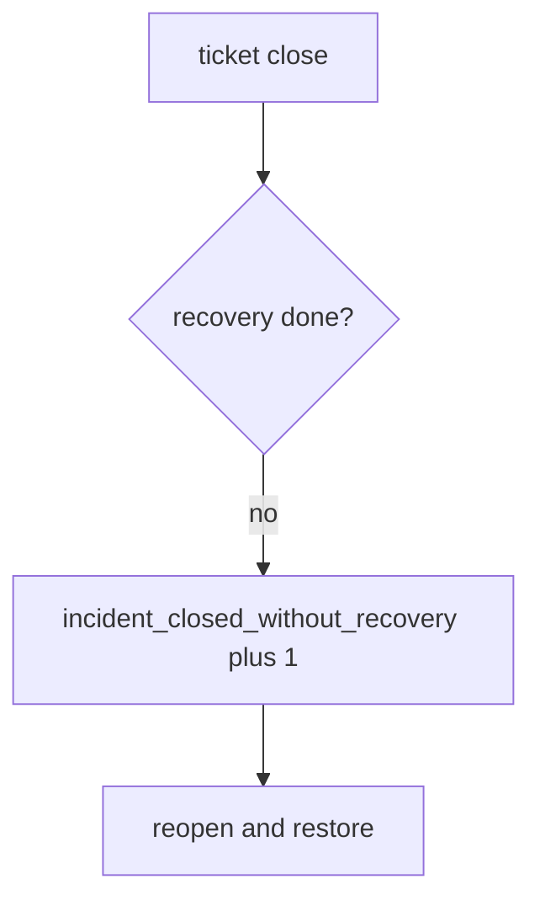

# Notice a close without recovery, without logging notes

**Kind:** operations-exercise
**Loop step:** 6 Operate

## Fixing it once is not enough

A closer can still mark Done after `close_incident` was repaired once. Do not log note bodies, session tokens, or dump files into the ticket. Do not paste note text into chat.

## Picture: illegal close is a signal

If an incident is closed without recovery, page the incident id — not the incident note. Then reopen and run the restore drill.



Buying a SIEM does not prove recovery ran. A tile that says restore ran is not that check.

Close without restore still has to fail `test_cannot_close_without_recovery`. Alerts stopping does not prove recovery ran. `test_cannot_close_when_logs_contain_note_body` still has to catch a second sink — crash reports and web telemetry can put the body back.

## Signals that do not become a second leak

| Outcome | This topic |
|---|---|
| Notice | `incident_closed_without_recovery` |
| What the line holds | Incident id, recovery state; **never** note bodies |
| Respond | Stop the closer that ignored recovery; do not paste note text into chat |
| Recover | Reopen; run restore drill; revoke leftover sessions |
| Leftover | Imperfect forensics; observability as a way out; recovery marked “not applicable” without an exception process |

A SIEM dashboard will show time-to-detect and stay silent when CI’s `close_incident` is always true. Detection must observe **recovery todo is deny**, not alert volume. If the alert includes a note body, you have opened a leftover-body leak.

```text
log_denied reason=incident_closed_without_recovery id=INC-12 recovery=todo
```

Not: a note body, a session token, or “assurance gate complete.”

Putting the matching note in the alert puts the incident text in the pager too.

## What the framework does vs what you still have to check

Always-true close, leftover bodies, and support-tool god-mode still close the incident even if SIEM is green.

The **cause** is close looking at detection quality instead of recovery done and no `note_body`; the **cost** is an attacker still in plus extra note copies; **how you stop it** is the conjunction; **how you notice** is `incident_closed_without_recovery`; **how you recover** is reopen and restore. What the tool cannot do: this alert does not prove the restore drill ran, and it does not ship logs to a separate system.

## Can people still use it

A reopen notice must say *recovery still todo*, not only “assert False.” Under stress, do not use color-only severity.

## Practice

```text
log_denied reason=incident_closed_without_recovery id=INC-12 recovery=todo
```

Reject any line that includes a note body, a session token, or “assurance gate complete.”

## Use it somewhere new

Reopen the SIEM-green ticket; do not paste note text into chat. Do not query a live SIEM.

## What this page is not doing

A green SIEM tile does not prove restore ran. This page does not mark you as finished. A known-exploited listing is not close. Answer keys are not on this site.
