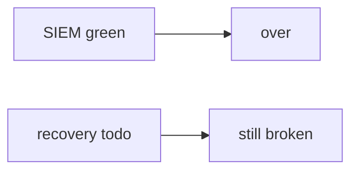

# Same idea on closing a clinic ticket because SIEM is green

**Kind:** transfer-challenge
**Loop step:** 7 Transfer

## Use it somewhere new

You get a **clinic that closes the ticket when the SIEM is green**.

On the notes app, `close_incident({"recovery": "todo", "logs": "ok"})` must be false. For a clinic, recovery todo denied, `note_body` denied, done + ok may close. A green SIEM is still a detect tile, not recover.

**Product sketch:** an EHR-lite “alerts stopped so we closed INC-12,” plus “we have nightly backups and a known-exploited dashboard.”

## Picture: same close loop, clinical object

Calling it “chart” instead of “note” does not move the work. Recovery evidence, log inventory, and leftover change. Filing a green tile and marking the ticket Done does not set `recovery` to `"done"`.

| Notes app this week | Clinic sketch |
|---|---|
| Incident ticket with recovery + logs | Clinic ticket with the same two fields |
| Restore drill before close | Same restore evidence on **local** practice files |
| `close_incident({"recovery": "todo", "logs": "ok"})` | Same call — recovery todo still denied |
| Optimistic closer / still-in actor | Same closer — **not** a live clinic SIEM |
| SIEM green / paging / known-exploited list | Same inputs — not the close decision |
| Ransomware restore vs note-level integrity | Disk image vs chart-body copies — name both |

If alerts stopped while `close_incident` is always true, the rule is gone. Paging, a known-exploited listing, and untested nightly backups do not set `recovery` to `"done"`. Ransomware restore (disk image) is a different grain from note-level integrity (no extra chart copies) — name both, do not run a live incident exercise here. Industry “recover” is an outcome label. A known-exploited list is patch-order input, not close. Logging every authorization decision without the sensitive data is extra, advanced work.

A recovery todo still has to be denied, and a note body still has to stay out. Done plus ok may still close. Wiring a paging product without the conjunction leaves `close_incident` true on todo. The local check is `test_cannot_close_without_recovery` — on a practice, not a live SIEM.

## Prompt — clinic close ticket when SIEM is green

1. who can act (optimistic closer / still-in actor — not a live clinic SIEM attack);
2. what you trust (recovery done and no `note_body` is the promise; SIEM, paging, known-exploited list, and untested backups are not);
3. what must not happen (`close_incident` true while recovery is todo, not a legal label);
4. a test idea on **local** practice files only (no live paging);
5. leftover (imperfect forensics, observability as a way out, support-tool god-mode, logging every authorization decision without the sensitive data);
6. whether engineers read the runbook under stress (plain language, not color-only severity).

Use fake labels. Do not use real patient names.

Also name ransomware restore vs note-level integrity.

## What is not good enough

| Reject | Why |
|---|---|
| “we have backups” | Untested is not recover |
| Live SIEM / ransomware tutorial | Course rules |
| “known-exploited listed so we closed” | Awareness / patch input, not close |
| “time-to-detect improved” | Detect metric, not recover |
| “assurance gate complete” | Forbidden stamp |

## Practice

One page. No answer keys. `labs/10.5/10.5-lab` is the only running system you may break. Do not query a live SIEM.

## What this page is not doing

Live-incident attacks. Real patient charts in logs. Claiming you finished an assurance gate from this page.
