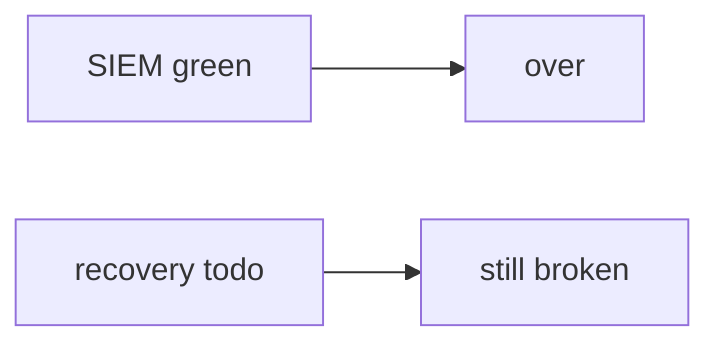

# 10.5-LO-07 — Transfer: clinic close ticket when SIEM is green

**Kind:** transfer-challenge
**Loop step:** 7 Transfer
**Standards:** ASVS `v5.0.0-16.2.5`. NIST CSF 2.0 Recover. CISA KEV as awareness not close.

## Change the workplace; keep SIEM-green from meaning recovered

Do not answer with a Top 10 / CWE / scanner as the definition of security.

**Prompt:** Clinic: close ticket when SIEM is green. Also name ransomware restore vs note-level integrity.

**Product sketch:** EHR-lite “alerts stopped so we closed INC-12,” plus “we have nightly backups and a KEV dashboard.”

Rewrite the SecureCollab sentence. Include:

1. attacker capabilities (optimistic closer / still-in actor — not a live clinic SIEM attack);
2. trust assumptions (recovery=done and no note_body is TCB; SIEM/PagerDuty/KEV/backups-untested are not);
3. forbidden outcome (`close_incident` true while recovery is todo, not “HIPAA”);
4. a test idea on a **local** fixture only (no live PagerDuty);
5. residual (imperfect forensics, observability exfil, support-tool god-mode, L3 clause of `v5.0.0-16.3.2`);
6. WCAG if the runbook is human-read under stress (not color-only severity).

## Mental model: green vs restored

## What graders reject

| Reject | Why |
|---|---|
| “we have backups” | Untested is not Recover |
| Live SIEM / ransomware tutorial | Lab policy |
| “KEV listed so we closed” | Awareness / patch input, not close |

## Practice

One page. No keys. `labs/10.5/10.5-lab` is the only running system you may break.
