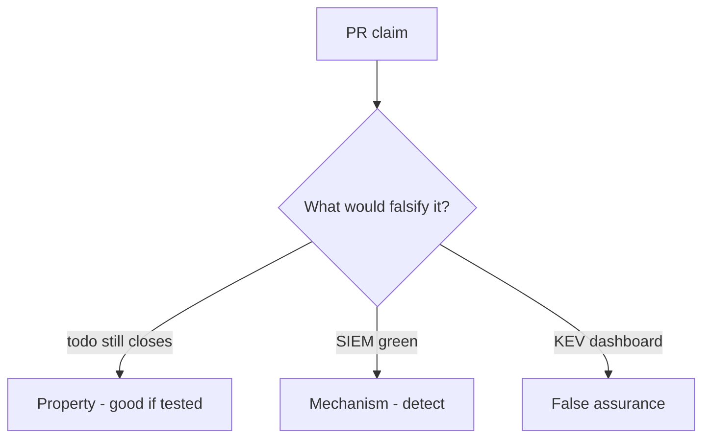

# 10.5-LO-08 — Review always-true close_incident as a PR

**Kind:** code-review
**Loop step:** Review
**Standards:** ASVS `v5.0.0-16.2.5`, `v5.0.0-16.4.3`. NIST CSF 2.0 Recover. CISA KEV as awareness.

## Review the fixture as if it were SecureCollab IR close

Review `labs/10.5/10.5-lab/vulnerable/` as a SecureCollab PR. Your job is not to count suspicious lines. Reconstruct whether `close_incident({"recovery": "todo", "logs": "ok"})` still returns true, compare that with the module invariant, and write changes a developer can verify.

Intended findings live only in `content/assessment/keys/10.5.md` — not here. Do not open the keys file until your review has been evaluated.

## Mental model: close with recovery todo

Start with this seeded smell: **close with recovery todo**. Label it property, mechanism, or false assurance before you accept the PR.

Classification starts at the protected effect (recovery todo denied). Everything that is not the conjunction at that call is a candidate always-close path. A SIEM screenshot without that pytest is the same smell, not a different finding class.

Note bodies in logs are the second forbidden outcome. Support-tool god-mode is 3.3. Do not skip `test_cannot_close_without_recovery`. Do not claim Gate 10. Do not query a live SIEM to prove the finding.

## Seeded smells (label them yourself)

- close with recovery todo
- Note bodies in logs
- No restore evidence
- Support tool is god-mode (3.3)

Also reject: live IR attacks; closing without re-running both deny tests; keys in lessons; claiming Gate 10 or M4; treating KEV as close.

## Misconceptions this module refuses

- MTTD is the goal
- Backups untested are recovery
- PagerDuty closes the incident
- A green SIEM is Recover
- Logging note bodies is forensics

## Practice

Write three review notes a maintainer could act on. Each note: observation, property or false assurance, suggested structural change, residual you will **not** delete. Tie at least one to `test_cannot_close_without_recovery`.

## Transfer

Clinic PR that “wired PagerDuty and a KEV feed” without a recovery-done check is an incomplete close-gate review. Name the independent falsehood that would still keep todo from closing.

## Non-goals

Do not merge by adding a comment “will restore later.” That comment is a residual without an owner. Do not run a live incident against a third-party system to prove the finding.
