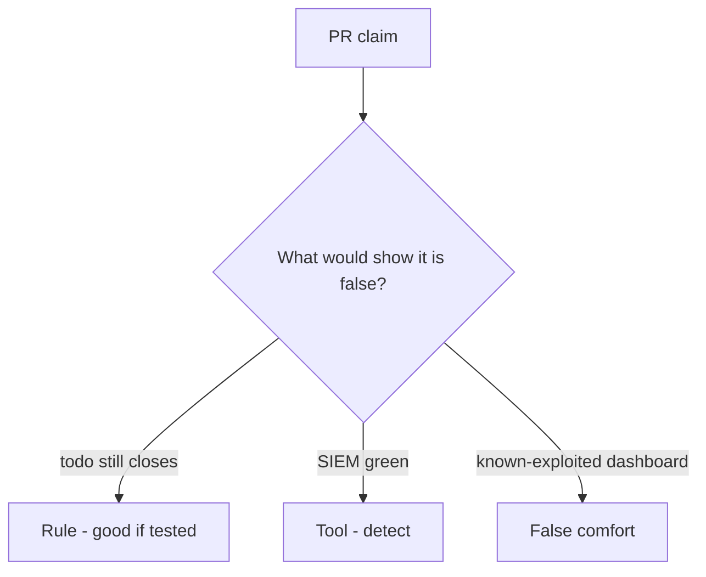

# Review always-true close_incident like a pull request

**Kind:** code-review
**Loop step:** Review

Intended findings live only in the answer-key folder — not here. Do not open that file until your review has been evaluated.

## What you are reviewing

A colleague ships the notes app’s incident close. Review `labs/10.5/10.5-lab/vulnerable/` as that change. Your job is not to count suspicious lines. Reconstruct whether `close_incident({"recovery": "todo", "logs": "ok"})` still returns true, compare that with the rule, and write changes a developer can verify.

Start at `close_incident` and the recovery-todo row, not at a scanner color or a SIEM screenshot. The check you already ran (`test_cannot_close_without_recovery`) is the rule test. A comment “will restore later” is not.

## Picture: close with recovery todo

Start with this seeded smell: **close with recovery todo**. Label it rule, tool, or false comfort before you accept the change.

Classification starts at the protected effect (recovery todo denied). Everything that is not the conjunction at that call is a candidate always-close path. A SIEM screenshot without that pytest is the same smell, not a different finding class.

Note bodies in logs are the second forbidden outcome. Support-tool god-mode is leftover from earlier cluster lessons. Do not skip `test_cannot_close_without_recovery`. Do not claim you finished an assurance gate. Do not query a live SIEM to prove the finding.

## Seeded smells (label them yourself)

- close with recovery todo
- note bodies in logs
- no restore evidence
- support tool is god-mode

Also reject: live incident attacks; closing without re-running both deny tests; keys in learner notes; claiming an assurance gate; treating a known-exploited list as close.

## Common mix-ups

- Time-to-detect is the goal
- Untested backups are recovery
- A paging ack closes the incident
- A green SIEM is recover
- Logging note bodies is forensics

## Practice

Write three review notes a maintainer could act on. Each note: what you saw, rule or false comfort, suggested structural change, leftover you will **not** delete. Tie at least one note to `test_cannot_close_without_recovery`. Do not open the keys file.

## Use it somewhere new

Clinic change that “wired paging and a known-exploited feed” without a recovery-done check is an incomplete close-gate review. Name the independent falsehood that would still keep todo from closing.

## Can people still use it

A reopen notice must say why the ticket stayed open (recovery still todo), not only “will restore later.”

## What this page is not doing

Do not merge by adding a comment “will restore later.” That comment is leftover without an owner. Do not run a live incident against a third-party system to prove the finding.
