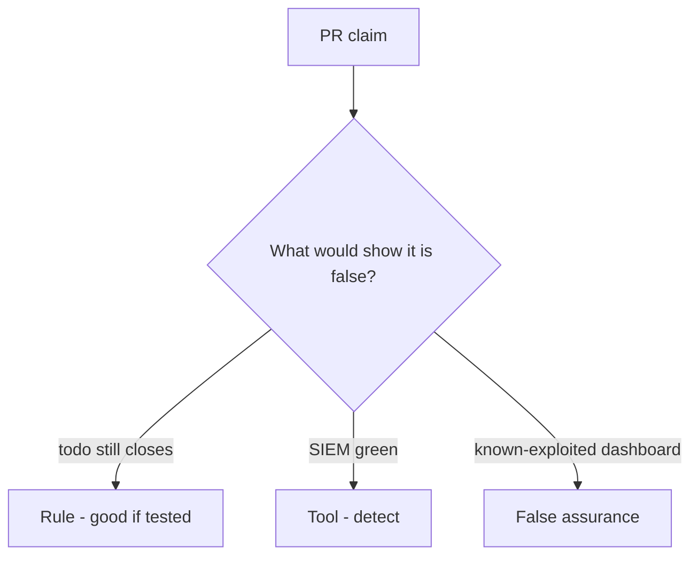

# Would you merge this always-true close_incident?

**Kind:** code-review
**Loop step:** Review

## What you are reviewing

Review `labs/10.5/10.5-lab/vulnerable/` as a change to the notes app’s incident close. Check whether `close_incident({"recovery": "todo", "logs": "ok"})` still returns true.

Start at `close_incident` and the recovery-todo row, not at a scanner color or a SIEM screenshot. A comment “will restore later” is not a pass on `test_cannot_close_without_recovery`.

## Picture: close with recovery todo

**close with recovery todo**.

A recovery todo still has to be denied. If the change never checks the conjunction, that always-close leftover is still open. A SIEM screenshot does not replace that check.

Note bodies in logs are the second what must not happen. Support-tool god-mode is leftover from earlier cluster lessons. Do not skip `test_cannot_close_without_recovery`. This page does not mark you as finished. Do not query a live SIEM to prove the finding.

## Problems to find (name them yourself)

- close with recovery todo
- note bodies in logs
- no restore evidence
- support tool is god-mode

Also reject: live incident attacks; closing without re-running both deny tests; keys in learner notes; claiming an assurance gate; treating a known-exploited list as close.

## Common mix-ups

- Time-to-detect is the goal
- Untested backups are recovery
- A paging ack closes the incident
- A green SIEM is recover
- Logging note bodies is forensics

## Use it somewhere new

Clinic change that “wired paging and a known-exploited feed” without a recovery-done check is an incomplete close-gate review. Name the independent falsehood that would still keep todo from closing.

## Can people still use it

A reopen notice must say why the ticket stayed open (recovery still todo), not only “will restore later.”

## What this page is not doing

Do not merge by adding a comment “will restore later.” That comment is leftover without an owner. Do not run a live incident against a third-party system to prove the finding.
