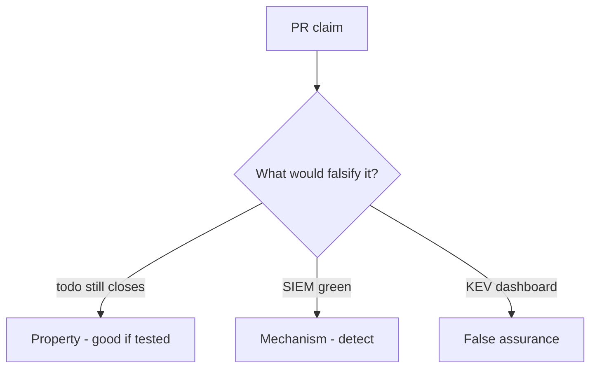

# 10.5-LO-08 — Review always-true close_incident as a PR

**Kind:** code-review
**Loop step:** Review
**Standards:** ASVS `v5.0.0-16.2.5`, `v5.0.0-16.4.3`. NIST CSF 2.0 Recover.

## Review the fixture as if it were SecureCollab IR close

Review `labs/10.5/10.5-lab/vulnerable/` as a SecureCollab PR. Intended findings live only in `content/assessment/keys/10.5.md` — not here.

## Mental model: property, mechanism, or false assurance

Seeded smells (label them yourself; do not open the keys file):

- close with recovery todo
- Note bodies in logs
- No restore evidence
- Support tool is god-mode (3.3)

Also reject: live IR attacks, keys in lessons, claiming Gate 10 or M4.

## Misconceptions

- MTTD is the goal
- Backups untested are recovery
- PagerDuty closes the incident

## Practice

Write three review notes. Tie at least one to `test_cannot_close_without_recovery`.

## Transfer

Clinic PR that “wired PagerDuty and a KEV feed” without a recovery-done check is incomplete.
