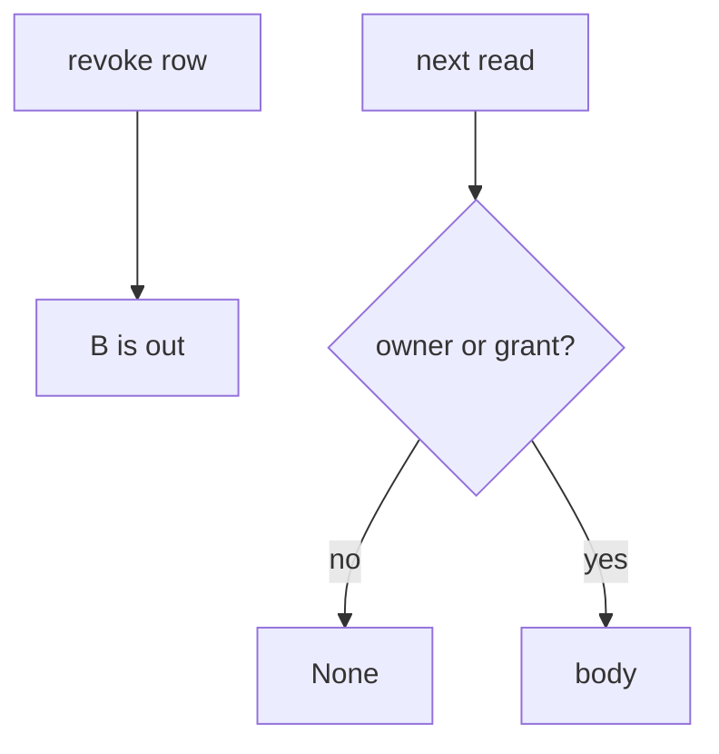
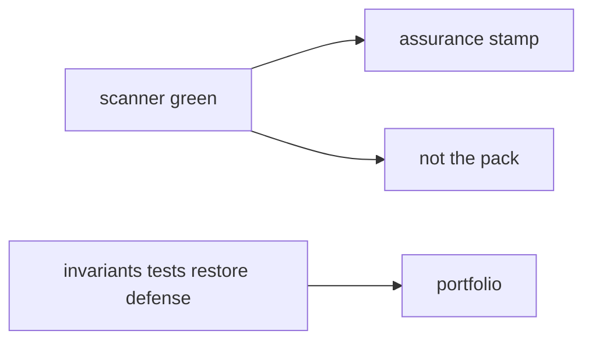

# Revoke has to be checked, not just recorded

**Kind:** concept-model
**Loop step:** 1 Property

## The rule

The notes app shares note `n1` from person A with person B, then A revokes. **Permission over time** is whether the *next* `read` looks at the grant. A green scanner, a YAML “evidence pack,” or an assurance stamp in a README is not that check.

> After `revoke("n1", "B")`, `read("n1", "B")` must be `None`. `read("n1", "A")` may still return the body. `read("n1", "B")` before revoke may return the body.

After revoke, B must not still **read the note**. That is the “check every access” idea from earlier weeks, stitched with time, revoke, delayed workers, and a phone cache.

There has to be a permission check on every access, not a share event that is forgotten. Access rights changing inside an already-open session without signing in again is extra, advanced work — named so you do not confuse “we stored a revoke row” with “the next read is denied.”

A numbered thirteen-item slogan is not the portable pack of tests, models, and restore notes this course asks for.

The practice is this course’s local files or official labs. Do not tell anyone to try attacks on public or third-party systems.

## Picture: event vs next read



## Picture: scanner is not the pack



pytest coverage, a capstone scanner, and “we finished the last phase” do not revoke B’s grant.

## People who can still read after revoke

| Person | What they can do here | Motive | Harm if read ignores the grant |
|---|---|---|---|
| Former collaborator | Present a cached note id | Keep reading | Ex-collaborator still sees the body |
| Delayed worker | Reuse a leftover user session | Finish a job | Same body on a path nobody checked |
| Someone who treats a green scanner as done | Skip the next-read check | Look finished | Event recorded; grant never consulted |

A former collaborator, a delayed worker, and a green scanner already read after revoke.

## Why it happens, what it costs, how you stop it, how you notice, how you recover

Someone recorded revoke and never asked the grant on the next read. That's the skipped grant check. The person who later reads the body is what happened next.

| Slice | For this rule |
|---|---|
| Why it happens | Grant not consulted after revoke |
| What's already wrong | `read` after `revoke` still returns the body |
| Trigger | Former collaborator; cached id; delayed worker |
| What it costs | Permission over time — ex-collaborator secrecy |
| How you stop it | Check owner-or-grant on every read; drop stale caches |
| How you notice | `revoked_share_read_denied` |
| How you recover | Notify A; rotate links; tabletop from the restore week |

## What the framework does vs what you still have to check

FastAPI will not consult a grant you never check. A phone cache and a worker leftover session are extra grains of the same rule.

`read("n1", "B")` after `revoke("n1", "B")` is `None`, while A may still read, and B before revoke may still read — files in `labs/11/11-lab`. Fake data only. No live tenants.

## What the tool cannot do

- Email already received the body — leftover copies from an earlier week.
- Export from B before revoke still on B’s disk.
- Delayed worker with a leftover user session.
- Access-rights change in the same session without signing in again, if the session was minted before revoke.

## Can people still use it

A denied read must say *share revoked* in words, not only a red 403. Do not use color as the only cue.

## Practice

Name who can revoke. Then run:

```text
python3 -m pytest labs/11/11-lab/tests --impl vulnerable
python3 -m pytest labs/11/11-lab/tests --impl fixed
```

## Use it somewhere new

Revoke a guardian. Full notes-app slice: the same rule across API, worker, and phone cache.

## What this page is not doing

Do not use live tenants. This page does not finish a check-in. Answer keys are not on this site.
