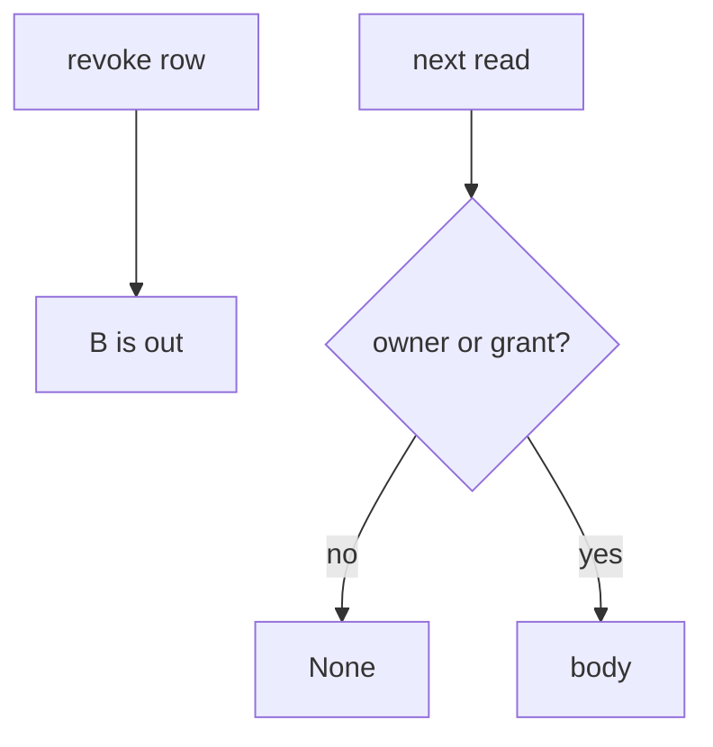
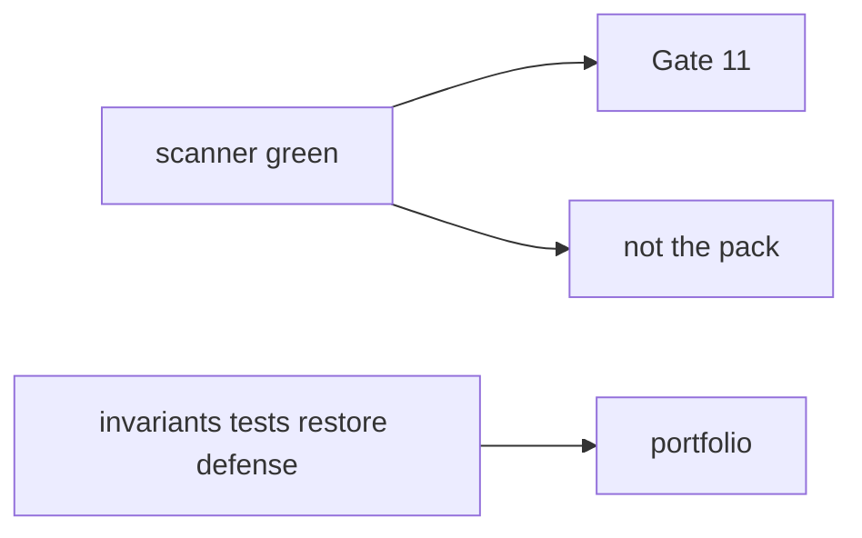

# 11-LO-01 — Revoke is mediation, not an event

**Kind:** concept-model
**Loop step:** 1 Property
**Standards:** ASVS `v5.0.0-8.2.1`, `v5.0.0-8.2.2`; `v5.0.0-8.3.2` is **Level 3, advanced**. Prior pins (MASVS 2.1.0, CSF 2.0, SLSA 1.2) are vocabulary, not a capstone-only standard.

## The claim this module owns

SecureCollab shares note `n1` from tenant A with tenant B, then A revokes. **Authorization over time** is whether the *next* `read` consults the grant. A green scanner, a YAML “evidence pack,” or Gate 11 in a README is not that check.

> After `revoke("n1", "B")`, `read("n1", "B")` must be `None`. `read("n1", "A")` may still return the body. `read("n1", "B")` before revoke may return the body.

The forbidden outcome is **revoked share still reads the note**. That is 1.2 complete mediation stitched with 2.4 time, 4.1/4.4 revoke, 7.4 delayed workers, and 8.2 device cache.

ASVS `v5.0.0-8.2.1` / `v5.0.0-8.2.2` want authorization on every access, not a share event that is forgotten. `v5.0.0-8.3.2` (access rights change takes effect within the session without re-login) is **Level 3, advanced** — named so learners do not confuse “we stored a revoke row” with “the next read is denied.”

The portable portfolio is blueprint §10.3. A numbered thirteen-item slogan is not that pack.

## Mental model: event vs next read



## Mental model: scanner is not the portfolio



**Mechanism (not the property):** pytest-cov, a capstone scanner, “we finished Phase 10.”

## Root cause vs impact vs prevention vs detection vs recovery

| Slice | For this property |
|---|---|
| Root cause | Grant not consulted after revoke |
| Preconditions | `read` after `revoke` still returns the body |
| Trigger | Former collaborator; cached id; delayed worker |
| Impact | Authorization over time — ex-collaborator confidentiality |
| Prevention | Complete mediation on every read; invalidate caches |
| Detection | `revoked_share_read_denied` |
| Recovery | Notify A; rotate links; tabletop (10.5) |

## Framework defaults versus the grant guarantee

FastAPI will not consult a grant you never check. A mobile cache (8.2) and a worker leftover session (7.4) are extra grains of the same cell.

## Mechanism limits

- Email already received the body — residual 5.1.
- Export from B before revoke still on B’s disk.
- Delayed worker with leftover user session (7.4).
- Level 3 `v5.0.0-8.3.2` if the session was minted before revoke.

## Usability and accessibility

A denied read must say *share revoked* in text, not only a red 403 (WCAG 2.2 4.1.3).

## Practice

Name who can revoke. Then run:

```
python3 -m pytest labs/11/11-lab/tests --impl vulnerable
python3 -m pytest labs/11/11-lab/tests --impl fixed
```

The first command must fail. The second must pass.

## Transfer

Clinic: revoke a guardian. Full SecureCollab slice: the same cell across API, worker, and mobile cache.

## Non-goals

Live tenants, claiming Gate 11 or M5. Answer keys are not in this file.
