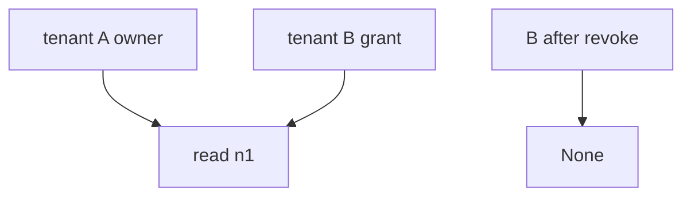
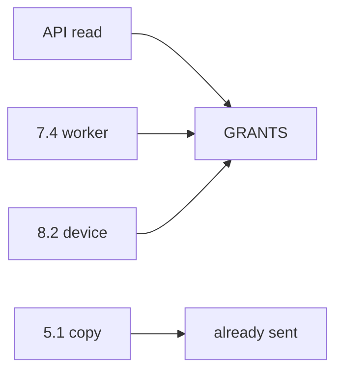

# 11-LO-02 — Grant consulted on every read

**Kind:** design-exercise
**Loop step:** 2 Model
**Standards:** ASVS `v5.0.0-8.2.1`, `v5.0.0-8.2.2`.

## Can a second engineer name the revoke check from your share map?

“We have a revoke endpoint” is not this lesson. A reviewable model names **owner, grant, every read path (API, worker, cache), and leftover copies**.

SecureCollab freeze: local `revoke` / `read`. No live tenants.

## Mental model: three subjects

## Mental model: other grains of the same cell

## Step 1: freeze pieces

| Piece | This system |
|---|---|
| Subjects | former collaborator; delayed worker |
| Objects | note body |
| Actions | `revoke`, `read` |
| Channels | API; worker; mobile cache |
| TCB | owner-or-grant on every read |
| Untrusted | cached id; scanner green; YAML pack |
| State / time | after revoke; leftover copies |
| 1.1 cell | authorization over time |

## Step 2: write cells

| Subject | Object | Action | Decision |
|---|---|---|---|
| B after revoke | n1 body | read | deny |
| A after revoke | n1 body | read | may allow |
| B before revoke | n1 body | read | may allow |
| scanner green | Gate 11 | claim | deny |

## Practice

Draw the map. Point at `labs/11/11-lab` file `capstone.py`.

## Transfer

Clinic guardian revoke is the same cell with a different relationship name.

## Residual risk

Copies already sent; `v5.0.0-8.3.2` Level 3 session that was minted before revoke.

## Non-goals

Top 10 as the definition of security. Keys stay out of lessons.
