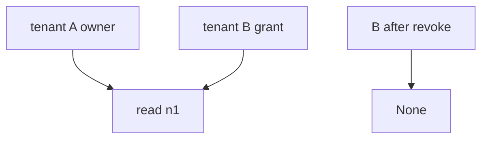
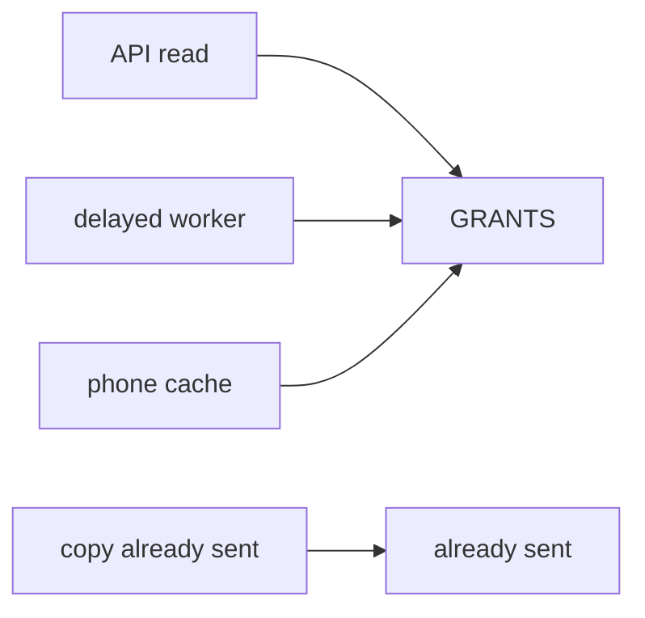

# Grant consulted on every read

**Kind:** design-exercise
**Loop step:** 2 Model

## Could someone else name the revoke check from your share map?

“We have a revoke endpoint” is not this lesson. A drawing someone else can test names **owner, grant, every read path (API, worker, cache), and leftover copies**.

`revoke` / `read` is local. No live tenants.

> After revoke, the rule is deny when the reader is not the owner and not in the grant set. Honest owner read after revoke may still return the body. Honest share read *before* revoke may still return the body. Evidence that the deny is false: `read("n1", "B")` after `revoke("n1", "B")` still returns the body.

If the owner-or-grant row is blank, B keeps reading because nobody named the check.

## Picture: three subjects

## Picture: other grains of the same rule

A copy already sitting in email is leftover, not this week's check.

## Step 1: name the pieces

Take the share you already have and ask what would show the grant was never consulted.

| Piece | This system |
|---|---|
| Who | former collaborator; delayed worker |
| What | note body |
| Actions | `revoke`, `read` |
| Paths | API; worker; phone cache |
| What you trust for this journey | owner-or-grant on every read |
| What you do not trust | cached id; scanner green; YAML pack |
| Time | after revoke; leftover copies |
| The rule | permission over time |

## Step 2: write allow and deny

| Who | What | Action | Decision |
|---|---|---|---|
| B after revoke | n1 body | read | deny |
| A after revoke | n1 body | read | may allow |
| B before revoke | n1 body | read | may allow |
| scanner green | assurance stamp | claim | deny |

A missing “B after revoke × body × deny” row is how a revoke event becomes “still readable.” Write the hole.

## Practice

Label `capstone.py` in `labs/11/11-lab`.

## Use it somewhere new

A clinic guardian revoke is the same rule with a different relationship name.

## What can still go wrong

Copies already sent. Access-rights change in the same session without signing in again is extra, advanced work, not this check.

## What this page is not doing

Answer keys are not on this site.
