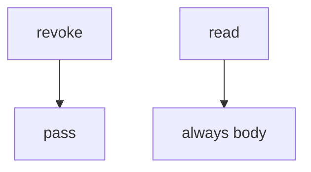

# 11-LO-03 — Observe no-op revoke, do not attack live tenants

**Kind:** mechanism-lab
**Loop step:** 3 Break
**Standards:** OWASP ASVS 5.0.0 (final) `v5.0.0-8.2.1`. `v5.0.0-8.3.2` in-session grant change is **Level 3, advanced**. Prior pins (MASVS 2.1.0, CSF 2.0, SLSA 1.2) are vocabulary, not a capstone-only standard. Lab policy: local only.

## Authorized scope

`labs/11/11-lab` only. The fixture is in-process `revoke` / `read` over synthetic tenants `A` / `B` and note `n1`. Do **not** revoke, read, or scrape a real notes app, clinic portal, or shared tenant as the exercise.

**Forbidden outcome:** Revoked share still reads the note. After `revoke("n1", "B")`, `read("n1", "B")` still returns the body.

Attacker capability in this lab: a former collaborator with a cached note id. That stands in for “we hit DELETE so the next chart read is fine,” a capstone scanner treated as Gate 11, or HTTP 200 on revoke treated as mediation. Trust assumption: `read` is supposed to consult **owner or grant on every access**. pytest-cov, a YAML evidence pack, and FastAPI 200 are not in the TCB for this cell.

## Mental model: revoke does nothing



The vulnerable tree demonstrates **cause** (grant not consulted). Do not probe public hosts. Preconditions: `revoke` is a no-op and `read` always returns the body. You do not need HTTP. You must not hit a live tenant.

ASVS `v5.0.0-8.2.1` wants authorization on every access. Module 1.2 already said complete mediation; 2.4 / 4.1 / 4.4 / 7.4 / 8.2 are the time and cache grains. This cell is **the stitch**. Gate 11 and M5 stay **not-attempted**.

## What to read in the fixture

`vulnerable/capstone.py` ignores `revoke` and returns the body. Tests:

- `test_revoked_share_cannot_read`
- `test_owner_may_still_read_after_revoke` — A may pass on both
- `test_share_may_read_before_revoke` — B before revoke may pass on both

You do not need a new tenant. The failure of `test_revoked_share_cannot_read` *is* the evidence. `conftest.py` calls `reset()` so grant state does not leak across tests.

Do not open the fixed tree yet. Diagnose the cause first.

## Root cause vs impact vs prevention vs detection vs recovery

| Slice | This lab |
|---|---|
| Required property | After revoke, `read("n1", "B")` is None |
| Root cause | Grant not consulted after revoke |
| Preconditions | `revoke` no-op; `read` always body |
| Trigger | Former collaborator; cached id; delayed worker |
| Impact | Ex-collaborator confidentiality |
| Prevention | Discard grant; consult owner-or-grant on every read |
| Detection | `revoked_share_read_denied`; never bodies |
| Recovery | Notify A; rotate links; wipe caches |
| Not the lesson | A capstone scanner; live clinic; Gate 11 complete |

## Framework defaults versus the mediation guarantee

FastAPI will return 200 for DELETE if you wrote that route. A scanner will stay green if the suite never reads after revoke. The application guarantee is: **this** fixture, B after revoke is None.

## Practice

```text
python3 -m pytest labs/11/11-lab/tests --impl vulnerable
```

Run from `labs/11/11-lab` if a repo-root collection picks up `site/`. Record `test_revoked_share_cannot_read`. Do not probe public hosts. An environment error is not security evidence.

## Transfer

Clinic revoke a guardian: predict without leaving this directory. Do not hit a live EHR.

## Non-goals

No live-tenant, clinic-portal, or public notes-app instructions. Do not claim Gate 11 or M5. A numbered thirteen-item slogan is not the portfolio (blueprint §10.3).
