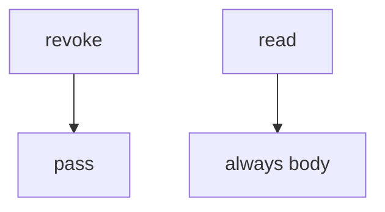

# Practice: no-op revoke

**Kind:** mechanism-lab
**Loop step:** 3 Break

## Try it

The practice is not a website you attack. `revoke` does nothing and a `read` that always returns the body: revoke never drops the grant, and read never asks, so a revoked share still reads.

> After `revoke("n1", "B")`, `read("n1", "B")` must be None. If it still returns the body, a revoked share still reads the note.

## Where you may practice

Stay inside `labs/11/11-lab`. The practice is `revoke` / `read` over synthetic people `A` / `B` and note `n1`. Do **not** revoke, read, or scrape a real notes app, clinic portal, or shared tenant as the exercise.

Do not paste this exercise onto a public clinic, employer notes app, or live hospital portal “to see what happens.”

`read` is supposed to consult **owner or grant on every access** — not pytest coverage, a YAML evidence pack, or FastAPI 200.

Picture a former collaborator with a cached note id — “we hit DELETE so the next chart read is fine,” a capstone scanner treated as an assurance stamp, or HTTP 200 on revoke treated as the check.

## Picture: revoke does nothing



You do not need HTTP. You must not hit a live tenant. The body after revoke is still readable.

Earlier weeks already said check every access. Time, revoke, leftover worker sessions, and phone cache are the other grains. This rule is **the stitch**. This page does not mark you as finished.

## What to look at: the cause, not a hunt

`vulnerable/capstone.py` ignores `revoke` and returns the body. Tests:

- `test_revoked_share_cannot_read`
- `test_owner_may_still_read_after_revoke` — A may pass on both
- `test_share_may_read_before_revoke` — B before revoke may pass on both

`conftest.py` calls `reset()` so grant state does not leak across tests.

| What you see | What kind of failure | Not the lesson |
|---|---|---|
| `revoke` is `pass` | No-op revoke; grant never dropped | “DELETE returned 200” |
| `read` always returns the body | Grant not consulted | A scanner badge |
| B after revoke still sees `secret` | What must not happen is allowed | “We have a revoke endpoint” |

## Why it happens vs what it costs

| Slice | Practice |
|---|---|
| The rule | After revoke, `read("n1", "B")` is None |
| Why it happens | Grant not consulted after revoke |
| What's already wrong | `revoke` no-op; `read` always body |
| Trigger | Former collaborator; cached id; delayed worker |
| What it costs | Ex-collaborator secrecy |
| How you stop it later | Discard grant; consult owner-or-grant on every read |
| How you notice later | `revoked_share_read_denied`; never bodies |
| How you recover later | Notify A; rotate links; wipe caches |
| Out of scope | A capstone scanner; live clinic; treating this capstone lesson as a check-in |

FastAPI will return 200 for DELETE if you wrote that route. A scanner will stay green if the suite never reads after revoke. B after revoke is None.

## Practice

```text
python3 -m pytest labs/11/11-lab/tests --impl vulnerable
```

Run from `labs/11/11-lab` if a collection at the repo root picks up `site/`. Do not probe public hosts. A setup error is not proof the rule holds.

## Use it somewhere new

Revoking a guardian still has to fail the next chart read. Predict without leaving this directory. Do not hit a live clinic system.

## What this page is not doing

No live-tenant, clinic-portal, or public notes-app instructions. This page does not mark you as finished. A numbered thirteen-item slogan is not the portable pack.
