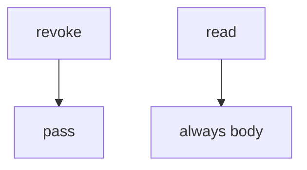

# 11-LO-03 — Observe no-op revoke, do not attack live tenants

**Kind:** mechanism-lab
**Loop step:** 3 Break
**Standards:** ASVS `v5.0.0-8.2.1`. Lab policy: local only.

## Authorized scope

`labs/11/11-lab` only. Synthetic tenants `A` / `B` and note `n1`. Do **not** revoke, read, or scrape a real notes app, clinic portal, or shared tenant as the exercise.

**Forbidden outcome:** Revoked share still reads the note.

## Mental model: revoke does nothing



The vulnerable tree demonstrates **cause** (grant not consulted). Do not probe public hosts.

## What to read in the fixture

`vulnerable/capstone.py` ignores `revoke` and returns the body. Tests require `read("n1", "B")` to be `None` after revoke.

## Root cause vs impact

| Slice | Lab |
|---|---|
| Root cause | Grant not consulted after revoke |
| Impact | Ex-collaborator still reads |
| Not the lesson | A capstone scanner as the definition |

## Practice

```
python3 -m pytest labs/11/11-lab/tests --impl vulnerable
```

Record `test_revoked_share_cannot_read`. Do not probe public hosts.

## Transfer

Clinic revoke a guardian: predict without leaving this directory.

## Non-goals

No live-tenant, clinic-portal, or public notes-app instructions.
