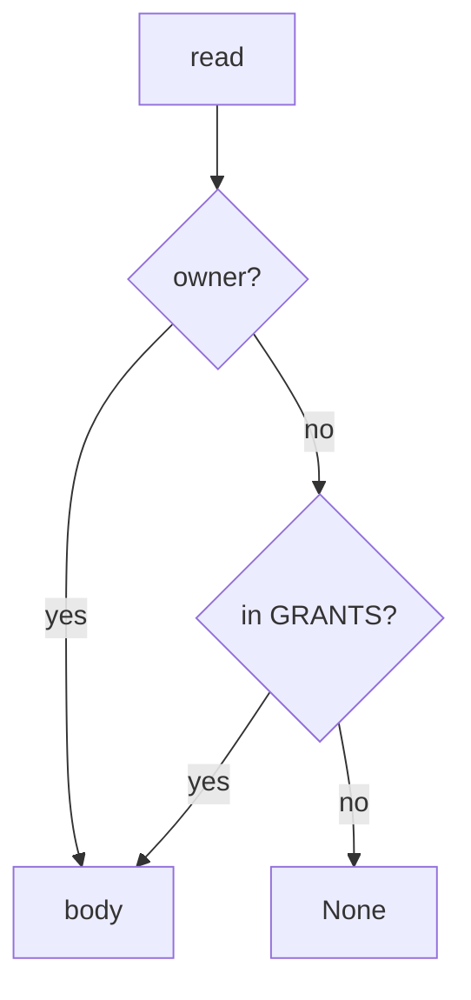

# Consult owner-or-grant on read

**Kind:** design-exercise
**Loop step:** 4 Build

## The rule

A revoke *event* does not consult the grant on the next read. HTTP 200 is a status. A scanner badge is a score. “We called revoke” is not `read` after `revoke`.

The restore: `revoke` **discards the grant**, and `read` **returns the body only if `tenant == owner` or `(nid, tenant) in GRANTS`**. Missing grant denies. A revoke that is not consulted on the next read is still the break. In plain words, that consultation — not HTTP 200, not a scanner badge, not a YAML pack.

Restore the notes app’s share with this: B after revoke → None, A still reads, B before revoke still reads. Fail-safe: if you are unsure whether the grant still exists, deny. Do not skip the deny because DELETE returned 200.

## Picture: consult on the path



Do not accept “we called revoke” as consultation. This `read` has to check owner-or-grant. Delayed workers and phone caches can still serve the old grant until those paths do the same. Copies already sent are gone from what this check can prove. Access-rights change inside an already-open session without signing in again is extra, advanced work: storing a revoke row is not in-session deny.

Permission has to be enforced — post-revoke read.

## What the repaired files must show

Do not treat `fixed/capstone.py` as a production share product.

| After the fix | Must be true |
|---|---|
| B after revoke | read None |
| A after revoke | read secret |
| B before revoke | read secret |

Fail closed: if you are unsure whether the grant is gone, return None. Uncertainty is a **no** on the body, not a yes because revoke was called.

## What this is not

- Scanner green.
- A YAML pack.
- An assurance-gate sticker.
- Cache wipe (phone leftover).
- Copies already sent.
- A mobile testing profile used as a web check.

## What the tool cannot do

- Delayed worker leftover session is a different grain from an earlier week.
- Phone cache is a different grain.
- Email already sent is leftover copies.
- Access-rights change in the same session without signing in again is leftover, not this revoke-on-read.
- A second note `n2` is not in the practice files.

## Practice

Name every read path. Run:

```text
python3 -m pytest labs/11/11-lab/tests --impl fixed
```

## Use it somewhere new

After a guardian is revoked, the next chart read must consult the grant, not the last login.

## What can still go wrong

Delayed worker. Phone cache. Access-rights change in the same session. Email already sent.

## What this page is not doing

Do not hit a live tenant. This page does not mark you as finished. A scanner screenshot is not a check-in. Do not treat a README checklist as mastery.
