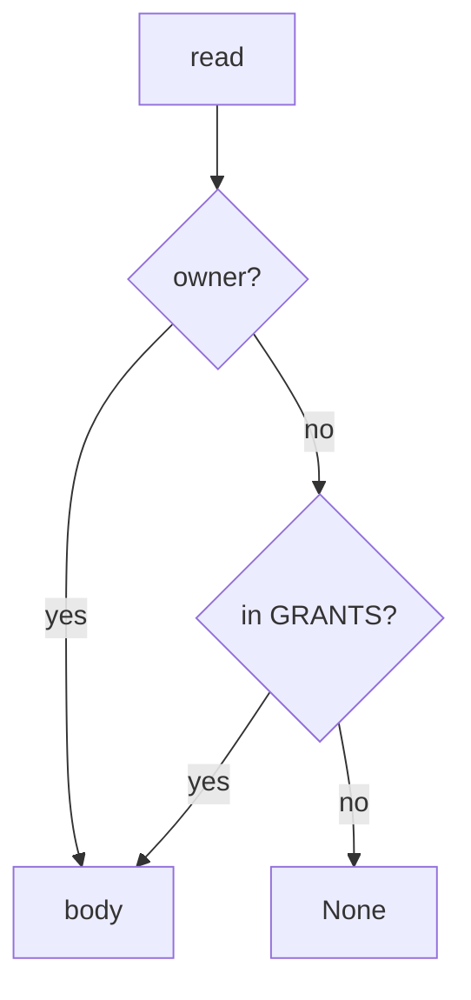

# 11-LO-04 — Consult owner-or-grant on read

**Kind:** design-exercise
**Loop step:** 4 Build
**Standards:** ASVS 5.0.0 (final) `v5.0.0-8.2.1`, `v5.0.0-8.2.2`. `v5.0.0-8.3.2` is **Level 3, advanced**.

## Structural means every read compares owner and grant

`revoke` must `discard` the grant. `read` must return the body only if `tenant == owner` or `(nid, tenant) in GRANTS`. Fail-safe: missing grant denies. A revoke *event* that is not consulted on the next read is still the break. Structural means that consultation — not HTTP 200, not a scanner badge, not a YAML pack.

The smallest restore for SecureCollab’s share is: B after revoke → None, A still reads, B before revoke still reads.

## Mental model: consult on the path



Do not accept “we called revoke” as consultation. Production still needs every *other* read path — delayed workers (7.4) and device caches (8.2) can serve the old grant. Copies already sent (5.1) are gone from the TCB of this pytest. `v5.0.0-8.3.2` (access-rights change takes effect within the session without re-login) is Level 3 advanced: storing a revoke row is not in-session deny.

ASVS `v5.0.0-8.2.2` wants authorization enforced. This pytest is that sentence for post-revoke read.

## Why this restores the cell

| After the fix | Must be true |
|---|---|
| B after revoke | read None |
| A after revoke | read secret |
| B before revoke | read secret |

## What this is not

Scanner green. YAML pack. Gate 11 / M5. Cache wipe (residual 8.2). Copies already sent (5.1). MASVS 2.1.0 as a web oracle.

## Mechanism limits

- Delayed worker leftover session is 7.4.
- Device cache is 8.2.
- Email already sent is 5.1.
- `v5.0.0-8.3.2` Level 3 in-session grant change is not this pytest.
- A second note `n2` is not in the fixture.

## Practice

Name every read path. Run:

```text
python3 -m pytest labs/11/11-lab/tests --impl fixed
```

Must pass. Run from the lab directory if collection at repo root is polluted.

## Transfer

Clinic guardian: the next chart read must consult the grant, not the last login.

## Residual risk

Delayed worker (7.4); device cache (8.2); `v5.0.0-8.3.2` Level 3; email already sent.

## Non-goals

Do not hit a live tenant. Do not claim Gate 11 from a scanner screenshot. Do not treat a README checklist as M5.
