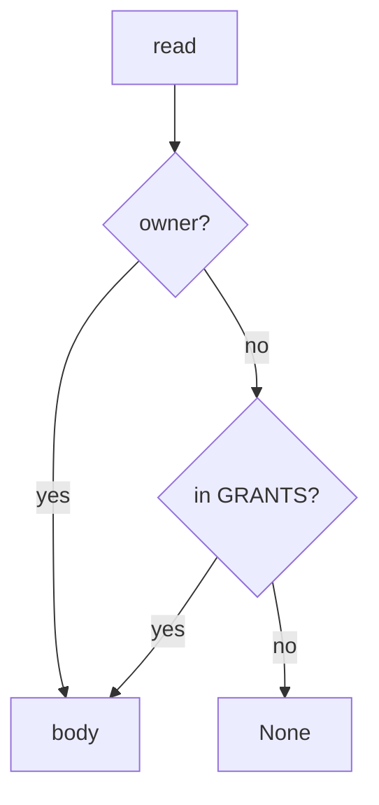

# 11-LO-04 — Consult owner-or-grant on read

**Kind:** design-exercise
**Loop step:** 4 Build
**Standards:** ASVS 5.0.0 (final) `v5.0.0-8.2.1`, `v5.0.0-8.2.2`.

## Structural means every read compares owner and grant

`revoke` must `discard` the grant. `read` must return the body only if `tenant == owner` or `(nid, tenant) in GRANTS`. Fail-safe: missing grant denies. A revoke *event* that is not consulted on the next read is still the break.

## Mental model: consult on the path



Do not accept “we called revoke” as consultation.

## Why this restores the cell

| After the fix | Must be true |
|---|---|
| B after revoke | read None |
| A after revoke | read secret |
| B before revoke | read secret |

## What this is not

Scanner green. YAML pack. Gate 11 / M5. Cache wipe (residual 8.2). Copies already sent (5.1).

## Practice

Name every read path. Run:

```
python3 -m pytest labs/11/11-lab/tests --impl fixed
```

Must pass.

## Transfer

Clinic guardian: the next chart read must consult the grant, not the last login.

## Residual risk

Delayed worker (7.4); device cache (8.2); `v5.0.0-8.3.2` Level 3; email already sent.
