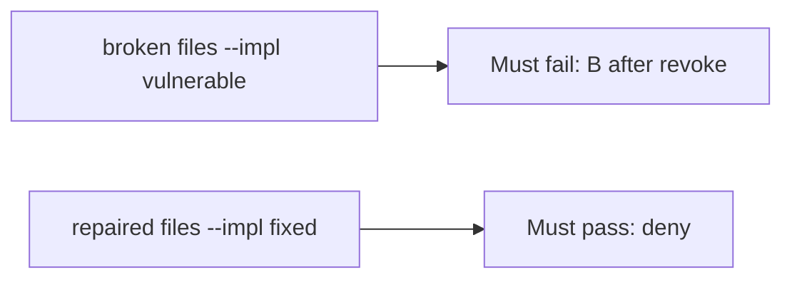

# A broken no-op revoke must fail the check

**Kind:** verification-lab
**Loop step:** 5 Verify

## Check it

“Capstone scanner green” is not evidence. “DELETE returned 200” is a tool observation. The check is: B after revoke is None, A after revoke still reads, B before revoke still reads. The B-after-revoke observation must be **false** on the broken files (returns the body) and **true** on the repaired files. Do not hit live tenants.

## Picture: a broken no-op revoke must fail the check

A passing-test tally can still hide that B after revoke still reads.



If both pass, you are not looking at B after revoke.

## What the check has to show

| Mode | Must show for this topic |
|---|---|
| Wrong input / abuse | B after revoke → None; broken files must fail |
| Normal | A after revoke → body (may pass on both) |
| Normal | B before revoke → body (may pass on both) |
| Not claimed | live clinic; an assurance gate; worker or cache wipe |

The test `test_revoked_share_cannot_read` is there so no-op `revoke` still fails. `conftest.py` calls `reset()` so grant state does not leak.

Honest owner-after-revoke and share-before-revoke may pass on both implementations. That does not excuse the B-after-revoke deny test. If the broken files do not fail `test_revoked_share_cannot_read`, the lab is miswired — fix the wiring, not the assertion.

```text
python3 -m pytest labs/11/11-lab/tests --impl vulnerable
python3 -m pytest labs/11/11-lab/tests --impl fixed
```

Searching for `revoke` in a README without calling `read("n1", "B")` after `revoke("n1", "B")` is not evidence. This practice never opens a live host.

## What the tests do not prove

- Worker leftover session is gone
- Phone cache is wiped
- Copies already sent are gone
- Access-rights change in the same session without signing in again
- An assurance gate complete

## Practice

```text
python3 -m pytest labs/11/11-lab/tests --impl vulnerable
python3 -m pytest labs/11/11-lab/tests --impl fixed
```

Do not treat a grep for `revoke` in a README as the check. Call `read("n1", "B")` after `revoke("n1", "B")`.

## Use it somewhere new

Asserting “revoke returned 200” is not this check. Do not use a live clinic system.

## What this page is not doing

Do not treat a live tenant screenshot as proof. Do not log note bodies. Answer keys are not on this site. This page does not mark you as finished.
