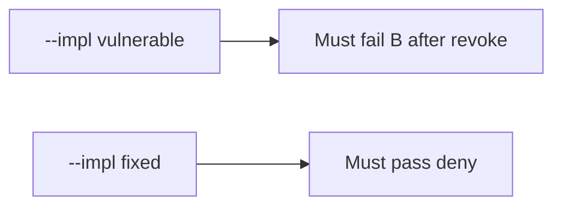

# 11-LO-05 — Evidence is revoke denied, then a passing pair

**Kind:** verification-lab
**Loop step:** 5 Verify
**Standards:** ASVS `v5.0.0-8.2.1`. Blueprint §10.3 portfolio is not this pytest.

## An invariant that cannot fail a test is still a slogan

“Capstone scanner green” is not evidence. “DELETE returned 200” is a mechanism observation. The oracle is: B after revoke is None, A after revoke still reads, B before revoke still reads. The B-after-revoke observation must be **false** on `--impl vulnerable` (returns the body) and **true** on `--impl fixed`. Do not hit live tenants.

## Mental model: vulnerable must fail: B after revoke

The failing observation on `--impl vulnerable` is **B after revoke**. A passing collection count is not this cell.



| Mode | Must show for this module |
|---|---|
| Negative / abuse | B after revoke → None; vulnerable must fail |
| Normal | A after revoke → body (may pass on both) |
| Normal | B before revoke → body (may pass on both) |
| Not claimed | live clinic; Gate 11; M5; worker/cache wipe |

Lab tests in `labs/11/11-lab/tests/test_property.py`. `test_revoked_share_cannot_read` is a **forbidden-outcome** test: no-op `revoke` is not allowed to count as a passing control. `conftest.py` calls `reset()` so grant state does not leak.

```text
python3 -m pytest labs/11/11-lab/tests --impl vulnerable
python3 -m pytest labs/11/11-lab/tests --impl fixed
```

Honest owner-after-revoke and share-before-revoke may pass on both implementations. That does not excuse the B-after-revoke deny test. If vulnerable does not fail `test_revoked_share_cannot_read`, the lab is miswired—fix the wiring, not the assertion.

## What the tests do not prove

- Worker leftover session is gone (7.4)
- Device cache is wiped (8.2)
- Copies already sent are gone (5.1)
- `v5.0.0-8.3.2` Level 3 in-session grant change
- Gate 11 / M5 complete

Record those as residuals or later modules, not as silent passes.

## Practice

Execute both implementations this session from the lab directory if needed. Write the fail/pass pair next to the matrix row. Reject a “test” that only greps `revoke` in a README without calling `read("n1", "B")` after `revoke("n1", "B")`.

## Transfer

Clinic: a test that only asserts “revoke returned 200” is not this cell. A live EHR is out of scope.

## Non-goals

Do not add a live-tenant trophy. Do not log note bodies. Keys stay out of this file. Gate 11 stays not-attempted.
