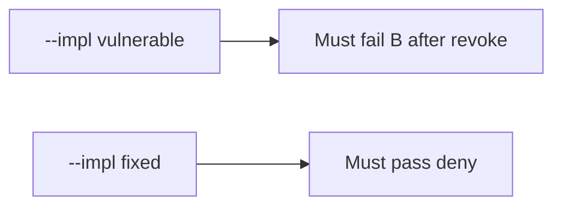

# 11-LO-05 — Evidence is revoke denied, then a passing pair

**Kind:** verification-lab
**Loop step:** 5 Verify
**Standards:** ASVS `v5.0.0-8.2.1`.

## An invariant that cannot fail a test is still a slogan

“Capstone scanner green” is not evidence. The oracle is the local pair. Do not hit live tenants.

## Mental model: vulnerable must fail: B after revoke

The failing observation on `--impl vulnerable` is **B after revoke**. A passing collection count is not this cell.



| Case | Must show |
|---|---|
| Negative / abuse | B after revoke → None |
| Normal | A after revoke → body |
| Normal | B before revoke → body |
| Not claimed | live clinic; Gate 11; M5 |

```
python3 -m pytest labs/11/11-lab/tests --impl vulnerable
python3 -m pytest labs/11/11-lab/tests --impl fixed
```

Honest owner-after-revoke and share-before-revoke may pass on both.

## What the tests do not prove

- Worker leftover session is gone (7.4)
- Device cache is wiped (8.2)
- Copies already sent are gone (5.1)
- `v5.0.0-8.3.2` Level 3 in-session grant change

## Practice

Execute both implementations. Map each test to an LO-02 cell.

## Transfer

Clinic: a test that only asserts “revoke returned 200” is not this cell.
