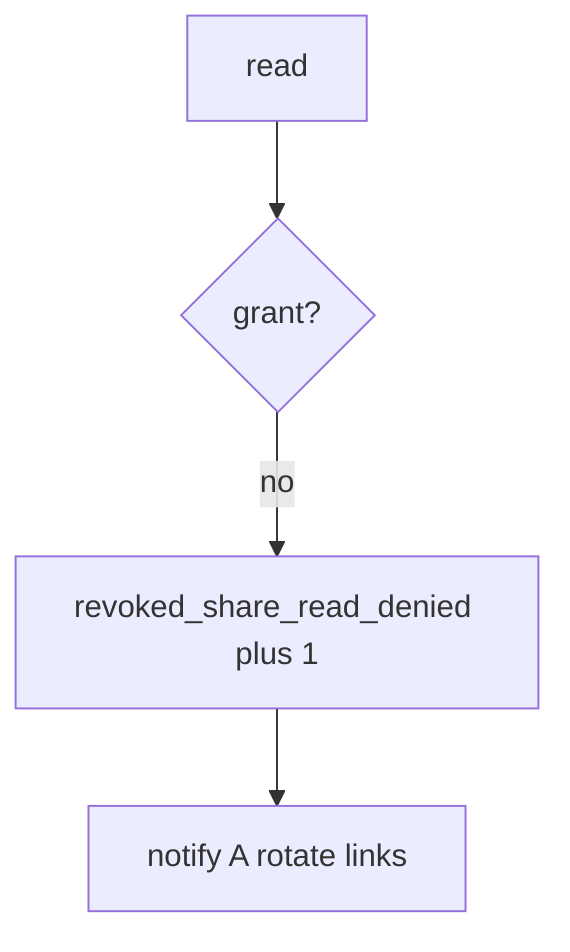

# Log the revoked-share deny, not the note

**Kind:** operations-exercise
**Loop step:** 6 Operate

## Fixing it once is not enough

A cache or worker can still serve the old grant after revoke. Skip note bodies, session tokens, dump files, and the chart in the ticket.

## Picture: post-revoke read is a signal

If someone reads a note without a grant, page the note id and the person — not the note. Then tell A and rotate the links.



Turning on a scanner does not consult the grant on the next read. This next-read check is still the proof.

After DELETE, `test_revoked_share_cannot_read` still has to go red if B can read. HTTP 200 on DELETE does not prove B cannot read. Phone cache and leftover worker sessions can still read after DELETE 200; revoke is not done until those paths are named. Tabletop remains the restore week.

## Signals that do not become a second leak

| Outcome | This topic |
|---|---|
| Notice | `revoked_share_read_denied` |
| What the line holds | note id, tenant id; **never** the body |
| Respond | Stop the former collaborator’s next read; do not paste note text into chat |
| Recover | Notify A; rotate share links; wipe caches |
| Leftover | Copies already sent; delayed worker; named exceptions later |

A scanner dashboard will show coverage and stay silent when CI’s `read` ignores grants. Detection must observe **B after revoke is None**, not “revoke was called.” If the alert includes the note body, you have opened a leftover-body leak.

```text
log_denied reason=revoked_share_read_denied note=n1 tenant=B
```

Not: a note body, a session token, or “check-in complete.”

Putting the matching note in the alert copies the leak into the ticket.

## What the framework does vs what you still have to check

No-op revoke, always-body read, and leftover worker sessions still serve the old grant even if the coverage dashboard is green.

Grant not consulted. That's the hole. Ex-collaborator secrecy is what you pay. Use owner-or-grant on every read. Alert on `revoked_share_read_denied`. Then notify-and-rotate. Logging does not wipe phone caches, and it does not recall copies already sent.

## Can people still use it

A deny must say *share revoked*, not only “assert False.” Under stress, do not use color-only severity.

## Practice

```text
log_denied reason=revoked_share_read_denied note=n1 tenant=B
```

A line that holds the note body, a session token, or “check-in complete” should never be written.

## Use it somewhere new

Deny the guardian read; do not paste the chart into the ticket. Do not hit a live clinic system.

## What this page is not doing

A coverage-dashboard sticker does not prove revoke. This page does not mark you as finished. A YAML pack does not watch leftover worker sessions. Answer keys are not on this site.
