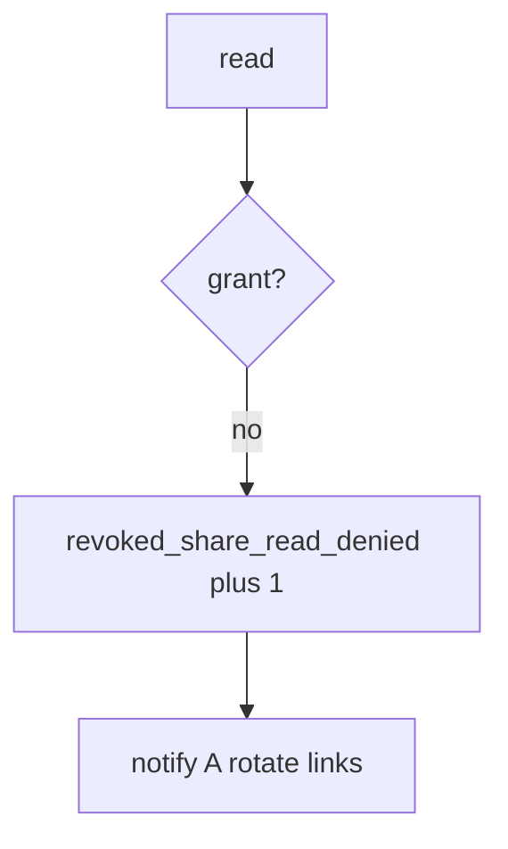

# 11-LO-06 — Detect revoked_share_read_denied without logging bodies

**Kind:** operations-exercise
**Loop step:** 6 Operate
**Standards:** NIST CSF 2.0 (final) DE/RS/RC as outcome labels; ASVS `v5.0.0-8.2.1`. Module 10.5 Recover is the incident sibling.

## Prevention is not absolute

A cache or worker can serve the old grant. Pair detect and recover. Do not log note bodies (3.1 / 10.5). Do not paste the chart into the ticket.

## Mental model: post-revoke read is a signal



| Outcome | This module |
|---|---|
| Detect | `revoked_share_read_denied` |
| Signal | note id, tenant id; never body |
| Recover | Notify A; rotate share links; wipe caches |
| Residual | Copies already sent; delayed worker; E6 exceptions |

CSF 2.0 Detect / Respond / Recover name outcomes. They do not prove `v5.0.0-8.2.1`. A scanner-product name is not the property. Re-run `test_revoked_share_cannot_read` after any share-path change; a green “DELETE 200” tile is not that pytest. Device cache (8.2) and leftover worker sessions (7.4) are other read paths of the same family — inventory them before claiming Recover. Tabletop remains 10.5.

## Framework defaults versus the operate guarantee

A scanner dashboard will show coverage and stay silent when CI’s `read` ignores grants. Detection must observe **B after revoke is None**, not “revoke was called.” If the alert includes the note body, you have opened a 3.1 / 10.5 cell.

## Practice

Write one log line you would accept. Tie it to `labs/11/11-lab`.

```text
log_denied reason=revoked_share_read_denied note=n1 tenant=B
```

Reject any line that includes the note body, a session token, or “Gate 11 complete.”

## Transfer

Clinic: deny the guardian read; do not paste the chart into the ticket. Do not hit a live EHR.

## Usability

A deny must say *share revoked*, not only “assert False” (WCAG 2.2 Success Criterion 4.1.3 for human-read CI).

Cause vs impact stays split here too: the **cause** is grant not consulted; the **impact** is ex-collaborator confidentiality; **prevention** is owner-or-grant on every read; **detection** is `revoked_share_read_denied`; **recovery** is notify-and-rotate. Mechanism limit: this alert does not wipe device caches (8.2) and does not recall copies already sent (5.1).

## Non-goals

A scanner-vendor name is not the property. M5 stays not-attempted. A YAML pack is not this alert.
