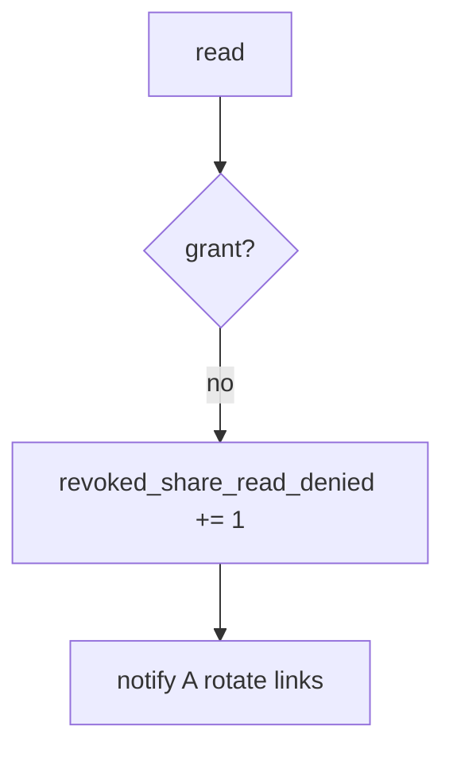

# 11-LO-06 — Detect revoked_share_read_denied without logging bodies

**Kind:** operations-exercise
**Loop step:** 6 Operate
**Standards:** NIST CSF 2.0 (final) DE/RS/RC as outcome labels; ASVS `v5.0.0-8.2.1`.

## Prevention is not absolute

A cache or worker can serve the old grant. Pair detect and recover. Do not log note bodies (3.1 / 10.5).

## Mental model: post-revoke read is a signal



| Outcome | This module |
|---|---|
| Detect | `revoked_share_read_denied` |
| Signal | note id, tenant id; never body |
| Recover | Notify A; rotate share links; wipe caches |
| Residual | Copies already sent; E6 exceptions |

## Practice

Write one log line you would accept. Tie it to `labs/11/11-lab`.

```
log_denied reason=revoked_share_read_denied note=n1 tenant=B
```

Reject any line that includes the note body, a session token, or “Gate 11 complete.”

## Transfer

Clinic: deny the guardian read; do not paste the chart into the ticket.

## Non-goals

A scanner-vendor name is not the property. M5 stays not-attempted.
