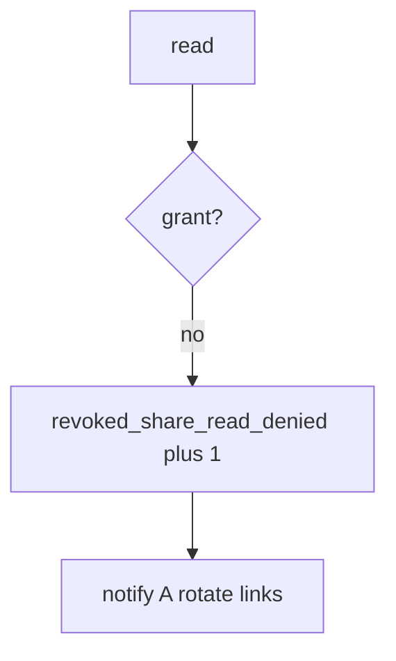

# Log the revoked-share deny, not the note

**Kind:** operations-exercise
**Loop step:** 6 Operate

## Fixing it once is not enough

A cache or worker can still serve the old grant after `read` was “fixed once.” Do not log note bodies, session tokens, or dump files into the ticket. Do not paste the chart into the ticket.

## Picture: post-revoke read is a signal

A read that skipped the grant is a notice-and-recover problem, not a licence to quote the note in the ticket. Notice names the note id and the person. Recover notifies A and rotates links. Neither reprints the body.



A scanner product is not the rule, and this week’s next-read check is not proof.

Re-run `test_revoked_share_cannot_read` after any share-path change. A green “DELETE 200” tile is not that check. Phone cache and leftover worker sessions are other read paths of the same family — inventory them before you claim recover. Tabletop remains the restore week.

## Signals that do not become a second leak

| Outcome | This topic |
|---|---|
| Notice | `revoked_share_read_denied` |
| What the line holds | note id, tenant id; **never** the body |
| Respond | Stop the former collaborator’s next read; do not paste note text into chat |
| Recover | Notify A; rotate share links; wipe caches |
| Leftover | Copies already sent; delayed worker; named exceptions later |

A scanner dashboard will show coverage and stay silent when CI’s `read` ignores grants. Detection must observe **B after revoke is None**, not “revoke was called.” If the alert includes the note body, you have opened a leftover-body leak.

```text
log_denied reason=revoked_share_read_denied note=n1 tenant=B
```

Not: a note body, a session token, or “assurance gate complete.”

If your alert includes the matching note, you have copied the leak into the ticket.

## What the framework does vs what you still have to check

The same no-op revoke, always-body read, and leftover worker session that bypass this practice will also bypass a “scan our coverage dashboard” detector. Name those places before you claim recover. A vendor name is not this week's rule.

Cause vs cost stays split here too: the **cause** is grant not consulted; the **cost** is ex-collaborator secrecy; **how you stop it** is owner-or-grant on every read; **how you notice** is `revoked_share_read_denied`; **how you recover** is notify-and-rotate. What the tool cannot do: this alert does not wipe phone caches, and it does not recall copies already sent.

## Can people still use it

A deny must say *share revoked*, not only “assert False.” Under stress, do not use color-only severity.

## Practice

Write one log line you would accept in review. Tie it to `labs/11/11-lab`.

```text
log_denied reason=revoked_share_read_denied note=n1 tenant=B
```

Reject any line that includes the note body, a session token, or “assurance gate complete.”

## Use it somewhere new

A clinic example: deny the guardian read; do not paste the chart into the ticket. Do not hit a live clinic system.

## What this page is not doing

A scanner-vendor name is not the rule. This page does not mark you as finished. A YAML pack is not this alert. Answer keys are not on this site.
