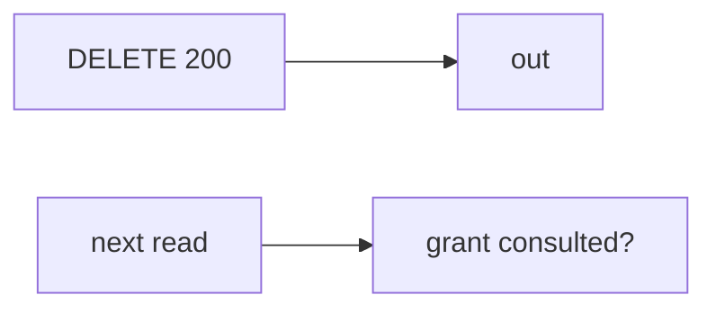

# Same idea on revoking a clinic guardian

**Kind:** transfer-challenge
**Loop step:** 7 Transfer

## Use it somewhere new

The notes-app scaffolding goes away. You get a **clinic that revokes a guardian**. Your job is to rewrite the loop, not to name a bug-list code.

The notes-app sentence was: after `revoke("n1", "B")`, `read("n1", "B")` must be None. Rewrite it for a clinic without changing the fork: B after revoke still has to be denied. A still reads. B before revoke still reads. HTTP 200 on DELETE is still an event, not the next-read check.

**Product sketch:** an EHR-lite “we hit DELETE /guardians/12 so the next chart read is fine,” plus “the capstone scanner is green so the assurance stamp is done.”

## Picture: same revoke loop, clinical object

Renaming “note” to “chart” is not transfer. Owner, grant, and leftover change. Filing DELETE 200 does not consult `GRANTS` on the next read.

| Notes app this week | Clinic sketch |
|---|---|
| Note `n1` shared with B | Chart shared with a guardian |
| `revoke("n1", "B")` then `read` | Revoke guardian then next chart read |
| Former collaborator with cached id | Former guardian with a cached chart id — **not** a live clinic |
| API + delayed worker + phone cache | Same three read paths — name them |
| Scanner green / YAML pack / DELETE 200 | Same inputs — not the next-read check |

If DELETE returns 200 while `read` ignores grants, the rule is gone. A scanner, a YAML pack, and an assurance stamp in a README do not consult `GRANTS`. The full slice is API + delayed worker + phone cache — name them, do not hit a live clinic system here. Access-rights change in the same session without signing in again is extra, advanced work: in-session grant change, not “we stored a revoke row.” A numbered slogan is not the portable pack.

B after revoke denied, A still reads, B before revoke still reads. Adding DELETE without consulting grants leaves `read` returning the body. The local check is `test_revoked_share_cannot_read` — on a practice, not a live tenant.

## Prompt — clinic revoke a guardian

Rewrite the notes-app sentence. Include:

1. who can act (former guardian with a cached chart id — not a live clinic attack);
2. what you trust (owner-or-grant on every read is the promise; scanner, YAML pack, and HTTP 200 are not);
3. what must not happen (`read` after `revoke` still returns the body, not a legal label);
4. a test idea on a **local** practice files only (no live clinic system);
5. leftover (copies already sent, delayed worker, phone cache, access-rights change in the same session);
6. whether a human-read deny must say share revoked (plain language, not color-only).

Use fake labels. Do not use real patient names.

Also name the full notes-app slice (API + worker + phone cache).

## What is not good enough

| Reject | Why |
|---|---|
| “scanner green” | Not the pack |
| Live clinic / guardian tutorial | Course rules |
| “assurance gate complete” | Forbidden stamp |
| “DELETE 200” | Event, not next-read check |
| “mastery because lessons exist” | File presence is not mastery |

## Practice

One page. No answer keys. `labs/11/11-lab` is the only running system you may break. Do not hit a live tenant.

## What this page is not doing

Live-tenant attacks. Real patient charts in notes. Claiming you finished an assurance gate from this page.
