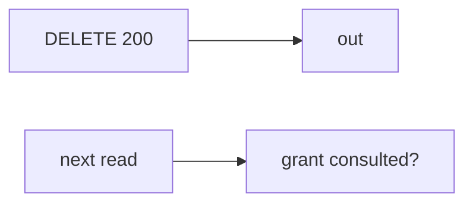

# 11-LO-07 — Transfer: clinic revoke a guardian

**Kind:** transfer-challenge
**Loop step:** 7 Transfer
**Standards:** ASVS `v5.0.0-8.2.1`. `v5.0.0-8.3.2` Level 3 advanced as residual.

## Change the workplace; keep revoke-200 from meaning the next read is denied

Do not answer with a Top 10 / CWE / scanner as the definition of security.

**Prompt:** Clinic: revoke a guardian. Also name the full SecureCollab slice (API + worker + mobile cache).

**Product sketch:** EHR-lite “we hit DELETE /guardians/12 so the next chart read is fine,” plus “the capstone scanner is green so Gate 11 is done.”

Rewrite the SecureCollab sentence. Include:

1. attacker capabilities (former guardian with a cached chart id — not a live clinic attack);
2. trust assumptions (owner-or-grant on every read is TCB; scanner/YAML pack/HTTP 200 are not);
3. forbidden outcome (`read` after `revoke` still returns the body, not “HIPAA”);
4. a test idea on a **local** fixture only (no live EHR);
5. residual (copies already sent, delayed worker, device cache, `v5.0.0-8.3.2` Level 3);
6. WCAG if the deny is human-read (say share revoked).

## Mental model: HTTP 200 vs next read

## What graders reject

| Reject | Why |
|---|---|
| “scanner green” | Not the portfolio |
| Live clinic / guardian tutorial | Lab policy |
| “Gate 11 complete” | No learner evidence |

## Practice

One page. No keys. `labs/11/11-lab` is the only running system you may break.
