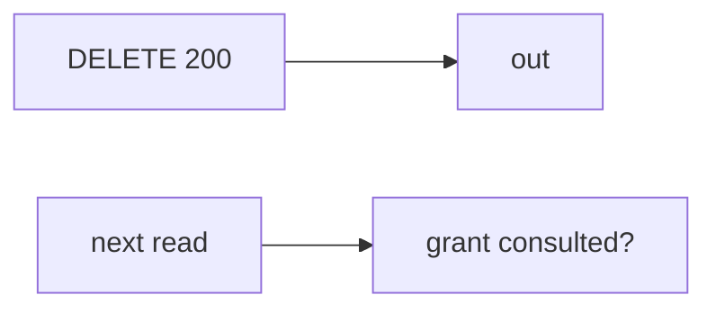

# 11-LO-07 — Transfer: clinic revoke a guardian

**Kind:** transfer-challenge
**Loop step:** 7 Transfer
**Standards:** ASVS `v5.0.0-8.2.1`. `v5.0.0-8.3.2` Level 3 advanced as residual. Blueprint §10.3 portfolio is not a scanner.

## Change the workplace; keep revoke-200 from meaning the next read is denied

Do not answer with a Top 10 / CWE / scanner as the definition of security. The SecureCollab sentence was: after `revoke("n1", "B")`, `read("n1", "B")` must be None. Rewrite it for a clinic without changing the fork.

**Prompt:** Clinic: revoke a guardian. Also name the full SecureCollab slice (API + worker + mobile cache).

**Product sketch:** EHR-lite “we hit DELETE /guardians/12 so the next chart read is fine,” plus “the capstone scanner is green so Gate 11 is done.”

Rewrite the SecureCollab sentence. Include:

1. attacker capabilities (former guardian with a cached chart id — not a live clinic attack);
2. trust assumptions (owner-or-grant on every read is TCB; scanner/YAML pack/HTTP 200 are not);
3. forbidden outcome (`read` after `revoke` still returns the body, not “HIPAA”);
4. a test idea on a **local** fixture only (no live EHR);
5. residual (copies already sent, delayed worker, device cache, `v5.0.0-8.3.2` Level 3);
6. WCAG if the deny is human-read (say share revoked).

## Mental model: HTTP 200 vs next read

If DELETE returns 200 while `read` ignores grants, the cell is gone. A scanner, a YAML pack, and Gate 11 in a README do not consult `GRANTS`. The full slice is API + delayed worker (7.4) + mobile cache (8.2) — name them, do not hit a live EHR here. `v5.0.0-8.3.2` is Level 3 advanced: in-session grant change, not “we stored a revoke row.” Blueprint §10.3 is the portable portfolio; a numbered slogan is not that pack.

The clinic rewrite still has to keep the SecureCollab fork: B after revoke denied, A still reads, B before revoke still reads. Adding DELETE without consulting grants leaves `read` returning the body. The local pytest analogue is `test_revoked_share_cannot_read` — on a fixture, not a live tenant.

## What graders reject

| Reject | Why |
|---|---|
| “scanner green” | Not the portfolio |
| Live clinic / guardian tutorial | Lab policy |
| “Gate 11 complete” | No learner evidence |
| “DELETE 200” | Event, not next-read mediation |
| “M5 done because lessons exist” | File presence is not mastery |

## Practice

One page. No keys. `labs/11/11-lab` is the only running system you may break. Do not hit a live tenant.

## Non-goals

Live-tenant attacks. Real PHI in notes. Claiming Gate 11 or M5 from this page.
