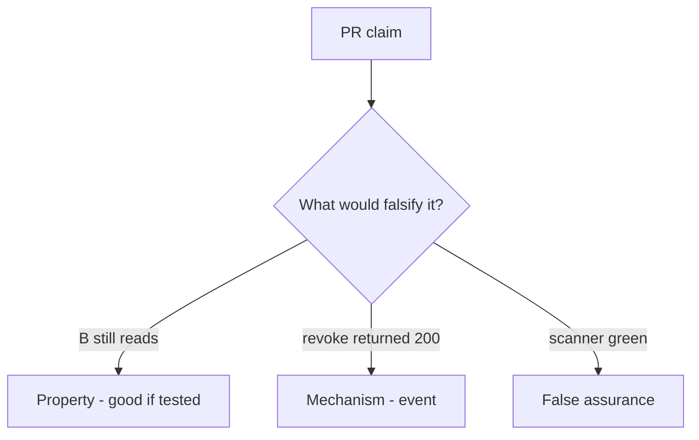

# 11-LO-08 — Review no-op revoke as a PR

**Kind:** code-review
**Loop step:** Review
**Standards:** ASVS `v5.0.0-8.2.1`, `v5.0.0-8.2.2`. Blueprint §10.3 portfolio.

## Review the fixture as if it were SecureCollab share revoke

Review `labs/11/11-lab/vulnerable/` as a SecureCollab PR. Your job is not to count suspicious lines. Reconstruct whether `read("n1", "B")` after `revoke("n1", "B")` still returns the body, compare that with the module invariant, and write changes a developer can verify.

Intended findings live only in `content/assessment/keys/11.md` — not here. Do not open the keys file until your review has been evaluated.

## Mental model: read after revoke succeeds

Start with this seeded smell: **read after revoke succeeds**. Label it property, mechanism, or false assurance before you accept the PR.

Classification starts at the protected effect (B after revoke is None). Everything that is not owner-or-grant at that call is a candidate always-read path. A scanner screenshot without that pytest is the same smell, not a different finding class.

Cache invalidation is 8.2. Worker leftover session is 7.4. Do not skip `test_revoked_share_cannot_read`. Do not claim Gate 11. Do not hit a live tenant to prove the finding.

## Seeded smells (label them yourself)

- read after revoke succeeds
- Capstone README: scanner green = done
- No cache invalidation
- Gate 11 claimed without artifacts

Also reject: live tenant attacks; merging without re-running `test_revoked_share_cannot_read`; keys in lessons; claiming Gate 11 or M5.

## Misconceptions this module refuses

- Capstone is a new product
- Milestones complete because lessons exist
- A green scanner is the evidence pack
- HTTP 200 on DELETE is complete mediation
- `v5.0.0-8.3.2` is this pytest (it is Level 3 residual)

## Practice

Write three review notes a maintainer could act on. Each note: observation, property or false assurance, suggested structural change, residual you will **not** delete. Tie at least one to `test_revoked_share_cannot_read`.

## Transfer

Clinic PR that “added DELETE /guardians and a scanner badge” without a post-revoke read deny is an incomplete mediation review. Name the independent falsehood that would still keep B from reading after revoke.

## Non-goals

Do not merge by adding a comment “will consult grants later.” That comment is a residual without an owner. Do not scrape a public notes app to prove the finding.
