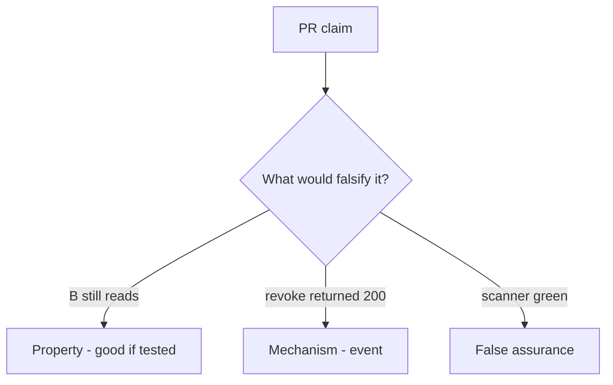

# 11-LO-08 — Review no-op revoke as a PR

**Kind:** code-review
**Loop step:** Review
**Standards:** ASVS `v5.0.0-8.2.1`, `v5.0.0-8.2.2`.

## Review the fixture as if it were SecureCollab share revoke

Review `labs/11/11-lab/vulnerable/` as a SecureCollab PR. Intended findings live only in `content/assessment/keys/11.md` — not here.

## Mental model: property, mechanism, or false assurance

Seeded smells (label them yourself; do not open the keys file):

- read after revoke succeeds
- Capstone README: scanner green = done
- No cache invalidation
- Gate 11 claimed without artifacts

Also reject: live tenant attacks, keys in lessons, claiming Gate 11 or M5.

## Misconceptions

- Capstone is a new product
- Milestones complete because lessons exist
- A green scanner is the evidence pack

## Practice

Write three review notes. Tie at least one to `test_revoked_share_cannot_read`.

## Transfer

Clinic PR that “added DELETE /guardians and a scanner badge” without a post-revoke read deny is incomplete.
