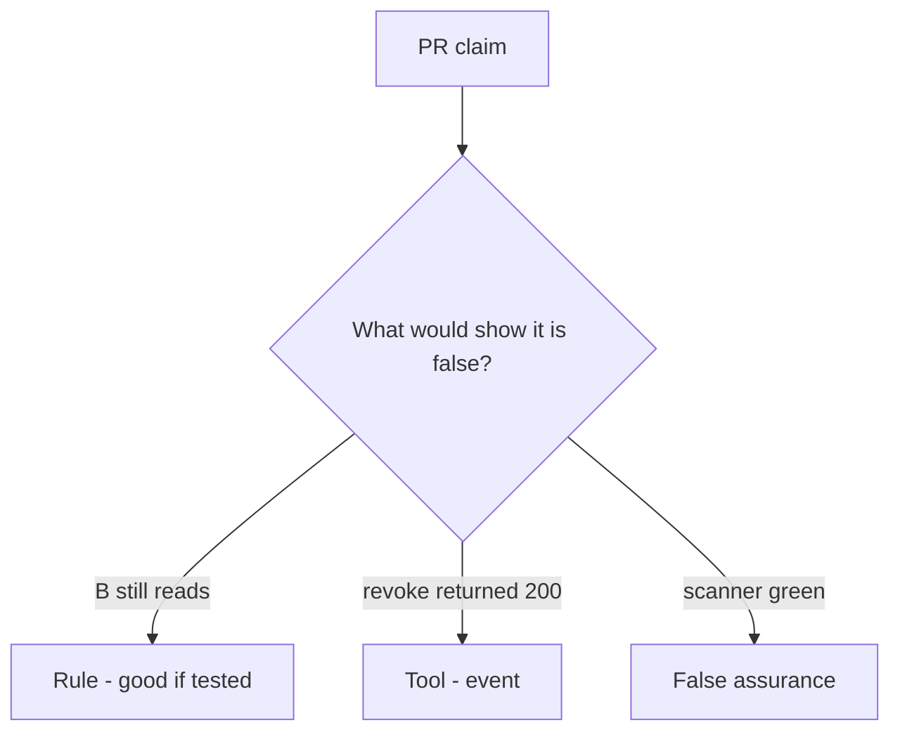

# Would you merge this no-op revoke?

**Kind:** code-review
**Loop step:** Review

## What you are reviewing

Review `labs/11/11-lab/vulnerable/` as a change to the notes app’s share revoke. Check whether `read("n1", "B")` after `revoke("n1", "B")` still returns the body.

Trace `revoke` / `read` and the B-after-revoke row. A README screenshot is decoration. `test_revoked_share_cannot_read` is the check; “will consult grants later” is a postponement.

## Picture: read after revoke succeeds

**read after revoke succeeds**.

B after revoke is still None. If the change never checks owner-or-grant, that always-read leftover is still open. A scanner screenshot does not replace that check.

Cache invalidation is a phone leftover. Worker leftover session is a delayed-job leftover. This page does not mark you as finished. Do not hit a live tenant to prove the finding.

## Problems to find (name them yourself)

- read after revoke succeeds
- Capstone README: scanner green = done
- No cache invalidation
- Assurance stamp claimed without artifacts

Also reject: live tenant attacks; merging without re-running `test_revoked_share_cannot_read`; keys in learner notes; claiming a check-in.

## Common mix-ups

- Capstone is a new product
- Milestones complete because lessons exist
- A green scanner is the evidence pack
- HTTP 200 on DELETE is the next-read check
- Access-rights change in the same session is this check (it is leftover, advanced work)

## Use it somewhere new

DELETE /guardians plus a scanner badge, without a post-revoke read deny, does not finish the next-read review. What would still keep B from reading after DELETE if a scanner badge is green?

## Can people still use it

A deny notice must say why the read was refused (share revoked), not only “will consult grants later.”

## What this page is not doing

Shipping “will consult grants later” leaves a revoked share readable with nobody assigned. Do not scrape a public notes app to prove the finding.
