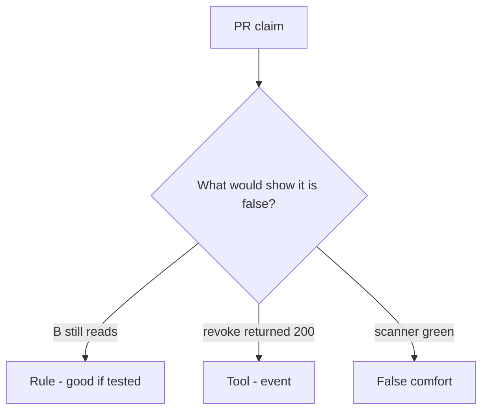

# Review no-op revoke like a pull request

**Kind:** code-review
**Loop step:** Review

Intended findings live only in the answer-key folder — not here. Do not open that file until your review has been evaluated.

## What you are reviewing

A colleague ships the notes app’s share revoke. Review `labs/11/11-lab/vulnerable/` as that change. Your job is not to count suspicious lines. Reconstruct whether `read("n1", "B")` after `revoke("n1", "B")` still returns the body, compare that with the rule, and write changes a developer can verify.

Start at `revoke` / `read` and the B-after-revoke row, not at a scanner color or a README screenshot. The check you already ran (`test_revoked_share_cannot_read`) is the rule test. A comment “will consult grants later” is not.

## Picture: read after revoke succeeds

Start with this seeded smell: **read after revoke succeeds**. Label it rule, tool, or false comfort before you accept the change.

Classification starts at the protected effect (B after revoke is None). Everything that is not owner-or-grant at that call is a candidate always-read path. A scanner screenshot without that pytest is the same smell, not a different finding class.

Cache invalidation is a phone leftover. Worker leftover session is a delayed-job leftover. Do not skip `test_revoked_share_cannot_read`. Do not claim you finished an assurance gate. Do not hit a live tenant to prove the finding.

## Seeded smells (label them yourself)

- read after revoke succeeds
- Capstone README: scanner green = done
- No cache invalidation
- Assurance stamp claimed without artifacts

Also reject: live tenant attacks; merging without re-running `test_revoked_share_cannot_read`; keys in learner notes; claiming an assurance gate.

## Common mix-ups

- Capstone is a new product
- Milestones complete because lessons exist
- A green scanner is the evidence pack
- HTTP 200 on DELETE is the next-read check
- Access-rights change in the same session is this pytest (it is leftover, advanced work)

## Practice

Write three review notes a maintainer could act on. Each note: what you saw, rule or false comfort, suggested structural change, leftover you will **not** delete. Tie at least one note to `test_revoked_share_cannot_read`. Do not open the keys file.

## Use it somewhere new

Clinic change that “added DELETE /guardians and a scanner badge” without a post-revoke read deny is an incomplete next-read review. Name the independent falsehood that would still keep B from reading after revoke.

## Can people still use it

A deny notice must say why the read was refused (share revoked), not only “will consult grants later.”

## What this page is not doing

Do not merge by adding a comment “will consult grants later.” That comment is leftover without an owner. Do not scrape a public notes app to prove the finding.
