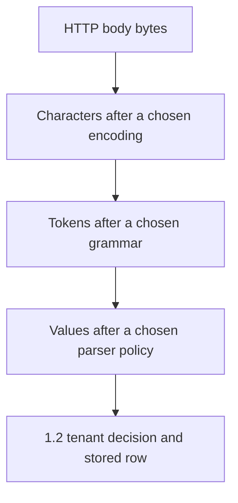
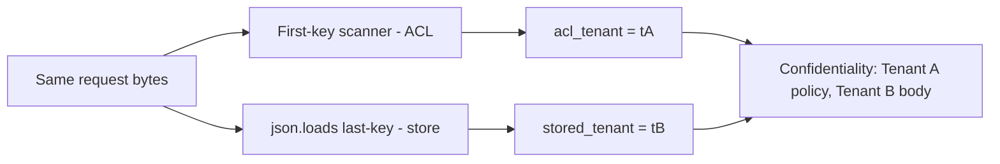

# 2.1-LO-01 — One byte sequence must mean one tenant

**Kind:** concept-model
**Loop step:** 1 Property
**Standards:** Saltzer and Schroeder (1975, seminal), especially economy of mechanism, fail-safe defaults, complete mediation, and least common mechanism; OWASP ASVS 5.0.0 (final) `v5.0.0-1.1.1`, `v5.0.0-2.2.1`, and `v5.0.0-2.2.2`; `v5.0.0-1.5.3` is Level 3 parser-consistency (labeled advanced, not the Phase 1 baseline); RFC 8259 JSON (STD 90, final) unique object names as SHOULD, not MUST; Unicode UAX #15 as *normalization*, not a security control by itself.

## The claim this module owns

SecureCollab Phase 1 ingest is still a JSON object with a tenant binding. Authentication can be correct, TLS can be correct, and a Tenant B member can still plant a body that Tenant A later reads—if two interpreters disagree about which tenant the bytes named.

> For a SecureCollab Phase 1 note ingest, the same request bytes yield one parse result used for both the 1.2 tenant decision and the stored row. If two interpreters would assign different tenant identifiers to those bytes, ingest rejects. Missing, duplicate, or unknown tenant meaning denies. The client encoder, a reverse proxy that re-encodes Unicode, and PostgreSQL `jsonb` are not the agreed parser.

The forbidden outcome is **parser differential**: ACL tenant ≠ stored tenant. That is a 1.1 confidentiality failure caused by *disagreement*, not by a missing login.

RFC 8259 says names within an object **SHOULD** be unique. CPython `json.loads` keeps the last duplicate. A regex that scans for the first `"tenant"` field keeps the first. Neither bug is “JSON is insecure.” The bug is treating two meanings of one byte sequence as if they were one object.

## Mental model: bytes are not characters, and characters are not values



Each arrow is an interpreter. Change the encoding, the grammar, or the duplicate-key policy and the value changes without the bytes changing. Unicode normalization (NFC vs NFD) is another interpreter *after* characters exist. UAX #15 tells you how to normalize; it does not decide which tenant a note belongs to.

**Mechanism (not the property):** Pydantic v2, FastAPI body parsing, or “JSON can’t have duplicate keys” is not this sentence.

## Mental model: two interpreters, one blob

The local lab uses the authorized ambiguous fixture (synthetic keys only):

```text
{"tenant":"tA","body":"secret","tenant":"tB"}
```



A later worker that re-parses stored text, or PostgreSQL `jsonb` ingest that disagrees with CPython, is the same picture with different boxes. Least common mechanism: one shared parse result is safer than “every layer parses again and hopes.”

ASVS `v5.0.0-1.5.3` asks that different parsers for the same data type parse consistently. It is **Level 3**. Phase 1 does not pretend you already run a multi-parser corpus in production. The lab proves the *shape*: disagreement is a forbidden outcome. Treat `1.5.3` as the later assurance bar, not as a silent baseline.

## Keep four words from collapsing

| Word | Precise question | SecureCollab example |
|---|---|---|
| Validation | Does this value match the expected structure and allow-list? | tenant is a known id; body is a string |
| Canonicalization | Have we chosen one representation before deciding? | one parse tree; reject duplicates rather than guess |
| Sanitization | Did we strip or rewrite hostile content for a *different* sink? | HTML sanitizer for a future preview (6.2 / PreviewForge) |
| Encoding | Did we escape for the *next* interpreter? | SQL parameters; HTML text nodes |

ASVS `v5.0.0-1.1.1` wants decode-to-canonical **once**, before further processing—not after a first parser already decided. `v5.0.0-2.2.1` wants positive structure checks. `v5.0.0-2.2.2` wants those checks on a trusted service layer; the browser’s `JSON.parse` is usability, not the TCB.

A WAF string that looks for `tenant` twice is sanitization theater. Whitespace, Unicode escapes, and a second content-type defeat it. Encoding the tenant for HTML output does not bind the stored row.

## Root cause vs impact vs prevention vs detection vs recovery

| Slice | For this property |
|---|---|
| Root cause | Two interpreters assigned two tenant meanings to one byte sequence |
| Preconditions | Duplicate or otherwise ambiguous tenant fields; split ACL vs persist parse |
| Trigger | `ingest_note` on the lab’s AMBIGUOUS blob, or a worker re-parse later |
| Impact | Confidentiality: Tenant B body stored under Tenant A policy, or the reverse |
| Prevention | Reject duplicate keys; pass one parse result to ACL and storage |
| Detection | `ingest_reject_duplicate_key` count; CI corpus of ambiguous objects; never log the body |
| Recovery | Quarantine rows whose ACL and store disagree; do not “repair” by picking a key |

## Framework defaults versus the ingest guarantee

CPython `json.loads` last-wins is a language accident, not a security control. Pydantic v2 will happily model a unique `tenant: str` after the parser already collapsed duplicates. PostgreSQL `jsonb` is another parser. FastAPI will parse a body with whichever JSON library it is configured to use.

The application guarantee is: **this** ingest function, on **this** fixture, either rejects the ambiguous object or yields `acl_tenant == stored_tenant`. The oracle is `labs/2.1/2.1-parser-boundaries`. It is not a live API and not a public JSON fuzzer.

## Mechanism limits

- Unicode NFC/NFD on *display names* does not substitute for tenant identifiers.
- YAML, GraphQL variables, multipart filenames, and XML each add grammars; agreeing JSON does not agree those.
- A second parse in a worker tomorrow is a new interpreter even if today’s handler is consistent.
- Canonicalization is not encryption. Honest unique-key JSON still needs 1.2 mediation.

## Practice

Draw the two-parser diagram for the lab’s AMBIGUOUS blob before you run tests. Name which box is ACL and which box is store. Then run the local pair:

```text
python3 -m pytest labs/2.1/2.1-parser-boundaries/tests --impl vulnerable
python3 -m pytest labs/2.1/2.1-parser-boundaries/tests --impl fixed
```

The first command must fail. The second must pass. Map the assertion to parser disagreement, not to a CWE mnemonic.

## Transfer

A clinic booking API accepts JSON where `patient_id` appears twice. REST and GraphQL both ingest the same appointment. Which interpreters sit on the path, and which 1.1 cell moves if they disagree?

## Non-goals

Live targets, public JSON bombs, real patient identifiers, overlong-UTF-8 copy-paste exploits, and “JSON is insecure” as the definition of security. Gates 0–10 and milestones M0–M5 stay **not-attempted** without learner or product evidence. Answer keys are not in this file.
