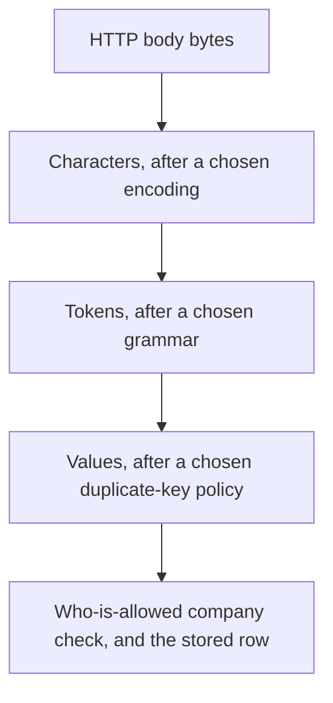
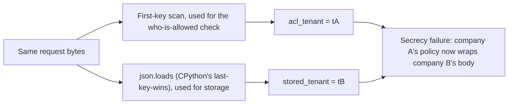

# One byte sequence must mean one company

**Kind:** concept-model
**Loop step:** 1 Property
**Standards:** OWASP ASVS 5.0.0 V1.1.1 (secure architecture requires a single trusted parse), V2.2.1 and V2.2.2 (input validation happens after canonicalization, at a trusted layer, not before), V1.5.3 (Level 3 — comprehensive input validation of untrusted data using a positive allow-list). IETF RFC 8259 §4 (JSON object names *should* be unique — a recommendation, not a requirement every reader honors identically).

## The rule

The notes app still takes in a JSON note that names a company. Login can be entirely correct, the transport pipe can be encrypted end to end, and a member of company B can still plant a body that company A later reads — if two readers of the exact same bytes disagree about which company those bytes named. This is the property this module teaches, and it is worth stating precisely because the failure it describes has nothing to do with authentication being weak.

> For a notes-app ingest, the same request bytes must yield one parse result used for both the who-is-allowed check and the stored row. If two readers would assign different company identifiers to those bytes, ingest refuses. Missing, duplicate, or unknown company meaning is a no. The client's own encoder, a reverse proxy that re-encodes Unicode, and PostgreSQL's `jsonb` column type are none of them the agreed reader — each is simply another reader that might disagree with the one you already trusted.

Unpack the clauses. "The same request bytes" is doing real work: this rule is not about two different requests, or a request and a stale cache — it is about one single HTTP body, read twice by two different pieces of code, disagreeing about what it means. "Used for both the who-is-allowed check and the stored row" names the two consumers whose agreement actually matters for this specific harm; other consumers (a display name shown in a UI, say) might tolerate disagreement without a secrecy consequence, but these two cannot. "Missing, duplicate, or unknown company meaning is a no" states the fail-safe default explicitly: uncertainty about which company is not resolved by guessing, it is resolved by refusing.

**ACL tenant ≠ stored tenant** is a secrecy failure caused by *disagreement between readers*, not by a missing login check. This distinction matters because a team that only tests "can an unauthenticated user reach this endpoint" will find nothing wrong here — the vulnerable fixture requires no bypassed authentication at all, only two technically correct parsers looking at the same bytes and reaching different conclusions.

The JSON specification, RFC 8259 §4, says that names within an object **should** be unique. It does not say they *must* be, and "should" in an RFC is a recommendation a compliant parser is free to handle however it chooses when violated. CPython's `json.loads` keeps the last value when a key repeats. A regex-based scan that looks for the first `"tenant"` field keeps the first. Neither implementation has a bug — both are doing exactly what their own documentation says they do. The actual defect is treating the two different meanings those two readers extract from one byte sequence as if they were guaranteed to be the same object, when nothing in either reader's contract promises that.

## Picture: bytes are not characters, and characters are not values



Each arrow in this chain is a place a reader makes a choice, and the diagram's point is that the same starting bytes can arrive at a different box at the bottom depending on which choice each arrow made. Change the encoding, the grammar, or the duplicate-key policy, and the value at the bottom changes without the bytes at the top changing at all — nobody tampered with the request; two pieces of code simply chose differently. Unicode normalization (NFC versus NFD, the two common ways to represent an accented character) is another reader that runs *after* characters already exist, and it answers a different question than this module's rule does: a normalization guide tells you how to write the same character the same way every time, which matters for string comparison, but it says nothing about which company a note belongs to. Confusing the two — treating "we normalize Unicode" as if it also resolved the duplicate-key question — is exactly the kind of category error this module exists to prevent.

Naming a library does not answer the question either. Pydantic v2 will happily validate a `tenant: str` field, but only after whatever JSON reader ran first has already collapsed any duplicates — Pydantic sees one value, not two, because the collapsing already happened. FastAPI's body parsing uses whichever JSON library it is configured to use, and that library's duplicate-key behavior is not FastAPI's choice to make differently. None of "we use Pydantic," "FastAPI validates the body," or "JSON can't have duplicate keys" is a true statement about what actually happens to a byte sequence that does.

## Picture: two readers, one blob

The local practice fixture uses this synthetic object (fake ids only, never a real company or a real note):

```text
{"tenant":"tA","body":"secret","tenant":"tB"}
```



A later worker that re-reads the stored text tomorrow, or a PostgreSQL `jsonb` ingest step that disagrees with what CPython already decided, is the same picture with different boxes standing in for "First" and "Last" — the specific technologies change, but the shape of the failure does not. One shared parse result, consumed by every downstream user of it, is structurally safer than every layer parsing the same bytes again and hoping its answer matches whatever answer a different layer already committed to.

A stricter bar than this module sets — one this course will return to later — asks that *every* reader of a given data type, across the whole system and across time, provably agree. This week's rule does not pretend that bar is already met in production; it is a narrower, checkable claim about one ingest function's two readers, on one fixture. The practice proves the *shape* of the defense: disagreement between two specific readers is what must not happen here. Treat the stricter, system-wide bar as a later topic rather than as something this fixture already demonstrates.

## Four words that are not the same

| Word | Precise question | Notes-app example |
|---|---|---|
| Validation | Does this value match the expected structure and an allow-list of acceptable values? | The company id is a known id from a fixed set; the body is a string |
| Canonicalization | Have we chosen exactly one representation of this value before anything else runs? | One parse tree per request; refuse duplicate keys rather than silently pick one |
| Sanitization | Did we strip or rewrite hostile content, for a *different*, later sink than the one that just consumed it? | An HTML cleaner applied before a future preview renders the body |
| Encoding | Did we escape this value for the *next* reader specifically, as opposed to the current one? | SQL bind parameters; HTML text-node escaping |

These four operations solve four different problems, and the confusion between them is not academic — a team that reaches for validation ("check the value looks like a company id") when the actual gap is canonicalization ("decide once, before validating anything, which of the duplicate values even counts") will ship a validator that happily approves an object whose meaning was never settled in the first place. Canonicalization has to happen first, and it has to happen exactly once, before anything downstream — including validation — runs on the result. Structure checks belong at a trusted service layer, after canonicalization; the browser's own `JSON.parse`, running in code you do not control, is a usability feature for the client, not a security boundary you can rely on.

A WAF rule that pattern-matches for the literal string `tenant` appearing twice is not canonicalization; it is a denylist wearing canonicalization's clothes, and it fails the moment whitespace, a Unicode escape sequence, or a second `Content-Type` header changes the bytes without changing the meaning a determined attacker intends. Encoding the company id for safe HTML output, similarly, does nothing to bind which row gets written to storage — encoding protects the *next* reader down a completely different path than the one that decides what gets persisted.

## Why it happens, what it costs, how you stop it, how you notice, how you recover

| Slice | For this rule |
|---|---|
| Why it happens | Two readers, each internally consistent, assign two different company meanings to one byte sequence |
| What's already wrong before the trigger | Duplicate or otherwise ambiguous company fields exist in the input, and the who-is-allowed check and the storage step use two different parsers to read them |
| Trigger | `ingest_note` runs on the messy two-company object, or a worker re-parses the same stored bytes later with a third reader |
| What it costs | A secrecy failure: company B's body gets stored under company A's access policy, or the reverse |
| How you stop it | Refuse on any disagreement among duplicate keys; pass exactly one parse result to both the ACL check and storage |
| How you notice | An `ingest_reject_duplicate_key` counter; a local corpus of intentionally messy objects run against the check; never log the body itself |
| How you recover | Quarantine any row whose ACL-time meaning and stored meaning disagree; do not "repair" a quarantined row by picking one of the disagreeing keys |

## What the framework does vs what you still have to check

CPython's `json.loads` keeping the last duplicate key is a documented language behavior, not a security control anyone designed for this purpose. Pydantic v2 will model a `tenant: str` field as though it were always unique, because by the time Pydantic sees the data, whichever reader ran first has already thrown away every value except one. PostgreSQL's `jsonb` type is itself another reader with its own rules about duplicate keys, and there is no guarantee its rules match CPython's. FastAPI will parse an incoming body with whichever JSON library it is configured to use, and changing that configuration changes this behavior without anyone necessarily noticing.

The ingest function in this module's fixture either refuses the messy object outright, or it yields `acl_tenant == stored_tenant` for every accepted object — the files live in `labs/2.1/2.1-parser-boundaries`. This is not a live API, and it is not a public JSON fuzzing target; it is a small, synthetic function whose entire job is to make one specific disagreement checkable.

## What the tool cannot do

- Unicode NFC/NFD normalization on *display names* does not stand in for, or substitute for, agreement on company identifiers — they are different values serving different purposes, and normalizing one does not canonicalize the other.
- YAML, GraphQL variables, multipart form filenames, and XML each introduce their own grammar with their own duplicate-handling and escaping rules; agreeing on how to read JSON does not make any of those other formats agree with each other or with JSON.
- A second parse performed by a worker tomorrow is a brand-new reader, even if today's request handler is perfectly internally consistent — consistency at one point in time and one place in the code is not the same claim as consistency everywhere, forever.
- Choosing one canonical representation is not encryption and does not substitute for it. Even an honest, genuinely unique-key JSON object still needs a separate who-is-allowed check; canonicalization answers "what does this mean," not "who may see it."

## Practice

Draw the two-reader diagram for the messy object yourself, before you run any check. Label which box is the ACL reader and which is the store reader — if you cannot say which is which without looking back at this lesson, you have not yet internalized the distinction the rest of this module depends on. Then run the local pair:

```text
python3 -m pytest labs/2.1/2.1-parser-boundaries/tests --impl vulnerable
python3 -m pytest labs/2.1/2.1-parser-boundaries/tests --impl fixed
```

The property under test is two readers disagreeing about a byte sequence's meaning. A bug-list nickname for this class of issue is not the property, and naming one does not substitute for tracing the actual disagreement in the code.

## Use it somewhere new

A clinic booking API accepts JSON where `patient_id` appears twice. Which readers actually sit on this request's path, and which secrecy consequence moves — from company-versus-company in the notes app to patient-versus-patient in the clinic — if those readers disagree? [Lesson 07 Transfer](07-transfer.md) works through this scenario fully; [Lesson 02 Model](02-model.md) is where the full reader-boundary map for this journey gets written down.

## What this page is not doing

Live targets, public JSON-bomb payloads, real patient identifiers, copy-paste encoding attack recipes, and "JSON is insecure" offered as a definition of security are all out of scope for this practice. Answer keys are not on this site; they live only in `content/assessment/keys/2.1.md`.
