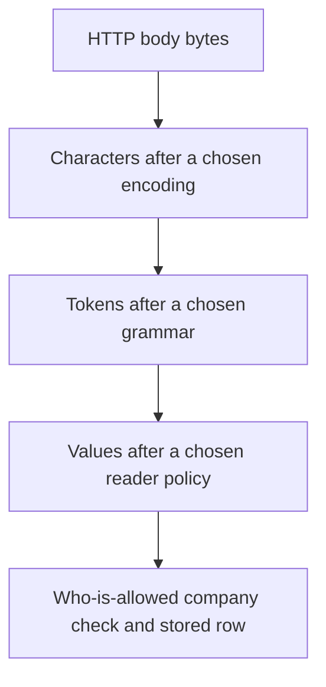
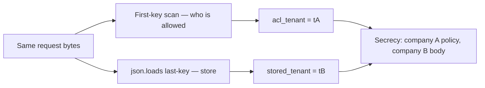

# One byte sequence must mean one company

**Kind:** concept-model
**Loop step:** 1 Property

## The rule

The notes app still takes in a JSON note that names a company. Login can be right, the pipe can be encrypted, and a member of company B can still plant a body that company A later reads — if two readers disagree about which company those bytes named.

> For a notes-app ingest, the same request bytes yield one parse result used for both the who-is-allowed check and the stored row. If two readers would assign different company identifiers to those bytes, ingest refuses. Missing, duplicate, or unknown company meaning is a no. The client encoder, a reverse proxy that re-encodes Unicode, and PostgreSQL `jsonb` are not the agreed reader.

So what must not happen: **ACL tenant ≠ stored tenant**. That is a secrecy failure caused by *disagreement*, not by a missing login.

The JSON spec says names in an object **should** be unique. It does not say they must be. CPython `json.loads` keeps the last duplicate. A scan that looks for the first `"tenant"` field keeps the first. Neither bug is “JSON is insecure.” The bug is treating two meanings of one byte sequence as if they were one object.

## Picture: bytes are not characters, and characters are not values



Each arrow is a reader. Change the encoding, the grammar, or the duplicate-key policy and the value changes without the bytes changing. Unicode normalization (NFC vs NFD) is another reader *after* characters exist. A Unicode guide tells you how to write the same character the same way. It does not decide which company a note belongs to.

Pydantic v2, FastAPI body parsing, or “JSON can’t have duplicate keys” does not pick which duplicate key wins.

## Picture: two readers, one blob

The local practice uses this synthetic object (fake ids only):

```text
{"tenant":"tA","body":"secret","tenant":"tB"}
```



A later worker that re-reads stored text, or PostgreSQL `jsonb` ingest that disagrees with CPython, is the same picture with different boxes. One shared parse result is safer than every layer parsing again and hoping.

A later, stricter bar asks that different readers of the same data type agree. This week does not pretend you already run a multi-reader corpus in production. The practice proves the *shape*: disagreement is what must not happen. Treat that later bar as later, not as a silent baseline.

## Four words that are not the same

| Word | Precise question | Notes-app example |
|---|---|---|
| Validation | Does this value match the expected structure and allow-list? | company id is known; body is a string |
| Canonicalization | Have we chosen one representation before deciding? | one parse tree; refuse duplicates rather than guess |
| Sanitization | Did we strip or rewrite hostile content for a *different* sink? | HTML cleaner for a future preview |
| Encoding | Did we escape for the *next* reader? | SQL parameters; HTML text nodes |

Decode to one form **once**, before anything else runs — not after a first reader already decided. Structure checks belong on a trusted service layer. The browser’s `JSON.parse` is usability, not what you trust.

A WAF string that looks for `tenant` twice is fake cleaning. Whitespace, Unicode escapes, and a second content-type defeat it. Encoding the company id for HTML output does not bind the stored row.

## Why it happens, what it costs, how you stop it, how you notice, how you recover

| Slice | For this rule |
|---|---|
| Why it happens | Two readers assigned two company meanings to one byte sequence |
| What's already wrong | Duplicate or otherwise messy company fields; split ACL vs persist parse |
| Trigger | `ingest_note` on the messy two-company object, or a worker re-parse later |
| What it costs | Secrecy: company B body stored under company A policy, or the reverse |
| How you stop it | Refuse duplicate keys; pass one parse result to ACL and storage |
| How you notice | `ingest_reject_duplicate_key` count; a local corpus of messy objects; never log the body |
| How you recover | Quarantine rows whose ACL and store disagree; do not “repair” by picking a key |

## What the framework does vs what you still have to check

CPython `json.loads` last-wins is a language accident, not a security control. Pydantic v2 will happily model a unique `tenant: str` after the reader already collapsed duplicates. PostgreSQL `jsonb` is another reader. FastAPI will parse a body with whichever JSON library it is configured to use.

The ingest function either refuses the messy object or yields `acl_tenant == stored_tenant` — files in `labs/2.1/2.1-parser-boundaries`. It is not a live API and not a public JSON fuzzer.

## What the tool cannot do

- Unicode NFC/NFD on *display names* does not stand in for company identifiers.
- YAML, GraphQL variables, multipart filenames, and XML each add grammars; agreeing JSON does not agree those.
- A second parse in a worker tomorrow is a new reader even if today’s handler is consistent.
- Choosing one representation is not encryption. Honest unique-key JSON still needs a who-is-allowed check.

## Practice

Draw the two-reader diagram for the messy object before you run checks. Name which box is ACL and which box is store. Then run the local pair:

```text
python3 -m pytest labs/2.1/2.1-parser-boundaries/tests --impl vulnerable
python3 -m pytest labs/2.1/2.1-parser-boundaries/tests --impl fixed
```

The check is two readers disagreeing. A bug-list nickname is not it.

## Use it somewhere new

A clinic booking API accepts JSON where `patient_id` appears twice. REST and GraphQL both ingest the same appointment. Which readers sit on the path, and which secrecy cell moves if they disagree?

## What this page is not doing

Do not use live targets, public JSON bombs, real patient identifiers, copy-paste encoding attacks, and “JSON is insecure” as the definition of security. Answer keys are not on this site.
